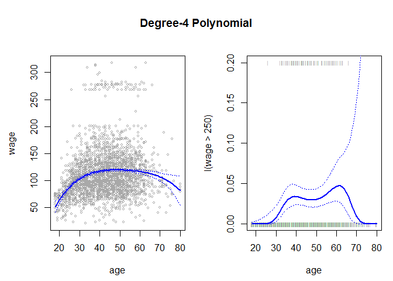
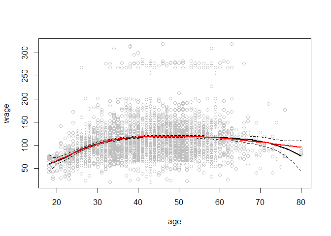
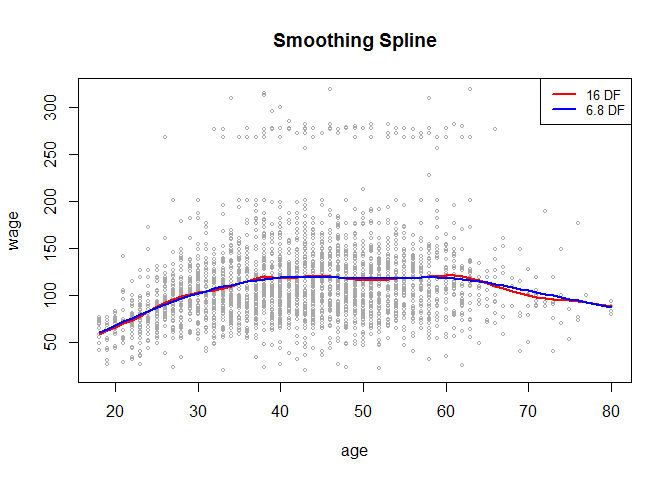
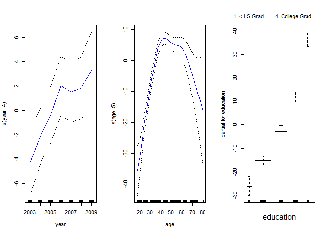
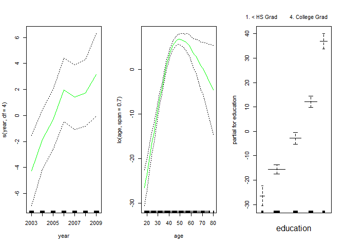
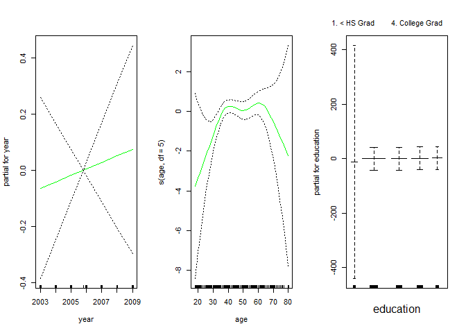

# Ch7 Non-linear Modeling

Codes from http://www-bcf.usc.edu/~gareth/ISL/All%20Labs.txt


```r
options(show.error.locations = TRUE)

library(ISLR)
```

```
## Warning: package 'ISLR' was built under R version 3.3.2
```

```r
attach(Wage)
```

# Polynomial Regression and Step Functions


```r
fit=lm(wage~poly(age,4),data=Wage)
coef(summary(fit))
```

```
##                 Estimate Std. Error    t value     Pr(>|t|)
## (Intercept)    111.70361  0.7287409 153.283015 0.000000e+00
## poly(age, 4)1  447.06785 39.9147851  11.200558 1.484604e-28
## poly(age, 4)2 -478.31581 39.9147851 -11.983424 2.355831e-32
## poly(age, 4)3  125.52169 39.9147851   3.144742 1.678622e-03
## poly(age, 4)4  -77.91118 39.9147851  -1.951938 5.103865e-02
```

```r
fit2=lm(wage~poly(age,4,raw=T),data=Wage)
coef(summary(fit2))
```

```
##                             Estimate   Std. Error   t value     Pr(>|t|)
## (Intercept)            -1.841542e+02 6.004038e+01 -3.067172 0.0021802539
## poly(age, 4, raw = T)1  2.124552e+01 5.886748e+00  3.609042 0.0003123618
## poly(age, 4, raw = T)2 -5.638593e-01 2.061083e-01 -2.735743 0.0062606446
## poly(age, 4, raw = T)3  6.810688e-03 3.065931e-03  2.221409 0.0263977518
## poly(age, 4, raw = T)4 -3.203830e-05 1.641359e-05 -1.951938 0.0510386498
```

```r
fit2a=lm(wage~age+I(age^2)+I(age^3)+I(age^4),data=Wage)
coef(fit2a)
```

```
##   (Intercept)           age      I(age^2)      I(age^3)      I(age^4) 
## -1.841542e+02  2.124552e+01 -5.638593e-01  6.810688e-03 -3.203830e-05
```

```r
fit2b=lm(wage~cbind(age,age^2,age^3,age^4),data=Wage)
agelims=range(age)
age.grid=seq(from=agelims[1],to=agelims[2])
preds=predict(fit,newdata=list(age=age.grid),se=TRUE)
se.bands=cbind(preds$fit+2*preds$se.fit,preds$fit-2*preds$se.fit)
par(mfrow=c(1,2),mar=c(4.5,4.5,1,1),oma=c(0,0,4,0))
plot(age,wage,xlim=agelims,cex=.5,col="darkgrey")
title("Degree-4 Polynomial",outer=T)
lines(age.grid,preds$fit,lwd=2,col="blue")
matlines(age.grid,se.bands,lwd=1,col="blue",lty=3)
preds2=predict(fit2,newdata=list(age=age.grid),se=TRUE)
max(abs(preds$fit-preds2$fit))
```

```
## [1] 7.81597e-11
```

```r
fit.1=lm(wage~age,data=Wage)
fit.2=lm(wage~poly(age,2),data=Wage)
fit.3=lm(wage~poly(age,3),data=Wage)
fit.4=lm(wage~poly(age,4),data=Wage)
fit.5=lm(wage~poly(age,5),data=Wage)
anova(fit.1,fit.2,fit.3,fit.4,fit.5)
```

```
## Analysis of Variance Table
## 
## Model 1: wage ~ age
## Model 2: wage ~ poly(age, 2)
## Model 3: wage ~ poly(age, 3)
## Model 4: wage ~ poly(age, 4)
## Model 5: wage ~ poly(age, 5)
##   Res.Df     RSS Df Sum of Sq        F    Pr(>F)    
## 1   2998 5022216                                    
## 2   2997 4793430  1    228786 143.5931 < 2.2e-16 ***
## 3   2996 4777674  1     15756   9.8888  0.001679 ** 
## 4   2995 4771604  1      6070   3.8098  0.051046 .  
## 5   2994 4770322  1      1283   0.8050  0.369682    
## ---
## Signif. codes:  0 '***' 0.001 '**' 0.01 '*' 0.05 '.' 0.1 ' ' 1
```

```r
coef(summary(fit.5))
```

```
##                 Estimate Std. Error     t value     Pr(>|t|)
## (Intercept)    111.70361  0.7287647 153.2780243 0.000000e+00
## poly(age, 5)1  447.06785 39.9160847  11.2001930 1.491111e-28
## poly(age, 5)2 -478.31581 39.9160847 -11.9830341 2.367734e-32
## poly(age, 5)3  125.52169 39.9160847   3.1446392 1.679213e-03
## poly(age, 5)4  -77.91118 39.9160847  -1.9518743 5.104623e-02
## poly(age, 5)5  -35.81289 39.9160847  -0.8972045 3.696820e-01
```

```r
(-11.983)^2
```

```
## [1] 143.5923
```

```r
fit.1=lm(wage~education+age,data=Wage)
fit.2=lm(wage~education+poly(age,2),data=Wage)
fit.3=lm(wage~education+poly(age,3),data=Wage)
anova(fit.1,fit.2,fit.3)
```

```
## Analysis of Variance Table
## 
## Model 1: wage ~ education + age
## Model 2: wage ~ education + poly(age, 2)
## Model 3: wage ~ education + poly(age, 3)
##   Res.Df     RSS Df Sum of Sq        F Pr(>F)    
## 1   2994 3867992                                 
## 2   2993 3725395  1    142597 114.6969 <2e-16 ***
## 3   2992 3719809  1      5587   4.4936 0.0341 *  
## ---
## Signif. codes:  0 '***' 0.001 '**' 0.01 '*' 0.05 '.' 0.1 ' ' 1
```

```r
fit=glm(I(wage>250)~poly(age,4),data=Wage,family=binomial)
preds=predict(fit,newdata=list(age=age.grid),se=T)
pfit=exp(preds$fit)/(1+exp(preds$fit))
se.bands.logit = cbind(preds$fit+2*preds$se.fit, preds$fit-2*preds$se.fit)
se.bands = exp(se.bands.logit)/(1+exp(se.bands.logit))
preds=predict(fit,newdata=list(age=age.grid),type="response",se=T)
plot(age,I(wage>250),xlim=agelims,type="n",ylim=c(0,.2))
points(jitter(age), I((wage>250)/5),cex=.5,pch="|",col="darkgrey")
lines(age.grid,pfit,lwd=2, col="blue")
matlines(age.grid,se.bands,lwd=1,col="blue",lty=3)
```

<!-- -->

```r
table(cut(age,4))
```

```
## 
## (17.9,33.5]   (33.5,49]   (49,64.5] (64.5,80.1] 
##         750        1399         779          72
```

```r
fit=lm(wage~cut(age,4),data=Wage)
coef(summary(fit))
```

```
##                         Estimate Std. Error   t value     Pr(>|t|)
## (Intercept)            94.158392   1.476069 63.789970 0.000000e+00
## cut(age, 4)(33.5,49]   24.053491   1.829431 13.148074 1.982315e-38
## cut(age, 4)(49,64.5]   23.664559   2.067958 11.443444 1.040750e-29
## cut(age, 4)(64.5,80.1]  7.640592   4.987424  1.531972 1.256350e-01
```

# Splines


```r
library(splines)
fit=lm(wage~bs(age,knots=c(25,40,60)),data=Wage)
pred=predict(fit,newdata=list(age=age.grid),se=T)
plot(age,wage,col="gray")
lines(age.grid,pred$fit,lwd=2)
lines(age.grid,pred$fit+2*pred$se,lty="dashed")
lines(age.grid,pred$fit-2*pred$se,lty="dashed")
dim(bs(age,knots=c(25,40,60)))
```

```
## [1] 3000    6
```

```r
dim(bs(age,df=6))
```

```
## [1] 3000    6
```

```r
attr(bs(age,df=6),"knots")
```

```
##   25%   50%   75% 
## 33.75 42.00 51.00
```

```r
fit2=lm(wage~ns(age,df=4),data=Wage)
pred2=predict(fit2,newdata=list(age=age.grid),se=T)
lines(age.grid, pred2$fit,col="red",lwd=2)
```

<!-- -->

```r
plot(age,wage,xlim=agelims,cex=.5,col="darkgrey")
title("Smoothing Spline")
fit=smooth.spline(age,wage,df=16)
fit2=smooth.spline(age,wage,cv=TRUE)
```

```
## Warning in smooth.spline(age, wage, cv = TRUE): cross-validation with non-
## unique 'x' values seems doubtful
```

```r
fit2$df
```

```
## [1] 6.794596
```

```r
lines(fit,col="red",lwd=2)
lines(fit2,col="blue",lwd=2)
legend("topright",legend=c("16 DF","6.8 DF"),col=c("red","blue"),lty=1,lwd=2,cex=.8)
```

<!-- -->

```r
plot(age,wage,xlim=agelims,cex=.5,col="darkgrey")
title("Local Regression")
fit=loess(wage~age,span=.2,data=Wage)
fit2=loess(wage~age,span=.5,data=Wage)
lines(age.grid,predict(fit,data.frame(age=age.grid)),col="red",lwd=2)
lines(age.grid,predict(fit2,data.frame(age=age.grid)),col="blue",lwd=2)
legend("topright",legend=c("Span=0.2","Span=0.5"),col=c("red","blue"),lty=1,lwd=2,cex=.8)
```

<!-- -->

# GAMs


```r
gam1=lm(wage~ns(year,4)+ns(age,5)+education,data=Wage)
library(gam)
```

```
## Warning: package 'gam' was built under R version 3.3.2
```

```
## Loading required package: foreach
```

```
## Loaded gam 1.14
```

```r
gam.m3=gam(wage~s(year,4)+s(age,5)+education,data=Wage)
par(mfrow=c(1,3))
plot(gam.m3, se=TRUE,col="blue")
```

<!-- -->

```r
plot.gam(gam1, se=TRUE, col="red")
```

<!-- -->

```r
gam.m1=gam(wage~s(age,5)+education,data=Wage)
gam.m2=gam(wage~year+s(age,5)+education,data=Wage)
anova(gam.m1,gam.m2,gam.m3,test="F")
```

```
## Analysis of Deviance Table
## 
## Model 1: wage ~ s(age, 5) + education
## Model 2: wage ~ year + s(age, 5) + education
## Model 3: wage ~ s(year, 4) + s(age, 5) + education
##   Resid. Df Resid. Dev Df Deviance       F    Pr(>F)    
## 1      2990    3711731                                  
## 2      2989    3693842  1  17889.2 14.4771 0.0001447 ***
## 3      2986    3689770  3   4071.1  1.0982 0.3485661    
## ---
## Signif. codes:  0 '***' 0.001 '**' 0.01 '*' 0.05 '.' 0.1 ' ' 1
```

```r
summary(gam.m3)
```

```
## 
## Call: gam(formula = wage ~ s(year, 4) + s(age, 5) + education, data = Wage)
## Deviance Residuals:
##     Min      1Q  Median      3Q     Max 
## -119.43  -19.70   -3.33   14.17  213.48 
## 
## (Dispersion Parameter for gaussian family taken to be 1235.69)
## 
##     Null Deviance: 5222086 on 2999 degrees of freedom
## Residual Deviance: 3689770 on 2986 degrees of freedom
## AIC: 29887.75 
## 
## Number of Local Scoring Iterations: 2 
## 
## Anova for Parametric Effects
##              Df  Sum Sq Mean Sq F value    Pr(>F)    
## s(year, 4)    1   27162   27162  21.981 2.877e-06 ***
## s(age, 5)     1  195338  195338 158.081 < 2.2e-16 ***
## education     4 1069726  267432 216.423 < 2.2e-16 ***
## Residuals  2986 3689770    1236                      
## ---
## Signif. codes:  0 '***' 0.001 '**' 0.01 '*' 0.05 '.' 0.1 ' ' 1
## 
## Anova for Nonparametric Effects
##             Npar Df Npar F  Pr(F)    
## (Intercept)                          
## s(year, 4)        3  1.086 0.3537    
## s(age, 5)         4 32.380 <2e-16 ***
## education                            
## ---
## Signif. codes:  0 '***' 0.001 '**' 0.01 '*' 0.05 '.' 0.1 ' ' 1
```

```r
preds=predict(gam.m2,newdata=Wage)
gam.lo=gam(wage~s(year,df=4)+lo(age,span=0.7)+education,data=Wage)
plot.gam(gam.lo, se=TRUE, col="green")
gam.lo.i=gam(wage~lo(year,age,span=0.5)+education,data=Wage)
```

```
## Warning in lo.wam(x, z, wz, fit$smooth, which, fit$smooth.frame,
## bf.maxit, : liv too small. (Discovered by lowesd)
```

```
## Warning in lo.wam(x, z, wz, fit$smooth, which, fit$smooth.frame,
## bf.maxit, : lv too small. (Discovered by lowesd)
```

```
## Warning in lo.wam(x, z, wz, fit$smooth, which, fit$smooth.frame,
## bf.maxit, : liv too small. (Discovered by lowesd)
```

```
## Warning in lo.wam(x, z, wz, fit$smooth, which, fit$smooth.frame,
## bf.maxit, : lv too small. (Discovered by lowesd)
```

```r
library(akima)
```

```
## Warning: package 'akima' was built under R version 3.3.2
```

<!-- -->

```r
plot(gam.lo.i)
gam.lr=gam(I(wage>250)~year+s(age,df=5)+education,family=binomial,data=Wage)
par(mfrow=c(1,3))
```

<!-- -->

```r
plot(gam.lr,se=T,col="green")
```

<!-- -->

```r
table(education,I(wage>250))
```

```
##                     
## education            FALSE TRUE
##   1. < HS Grad         268    0
##   2. HS Grad           966    5
##   3. Some College      643    7
##   4. College Grad      663   22
##   5. Advanced Degree   381   45
```

```r
gam.lr.s=gam(I(wage>250)~year+s(age,df=5)+education,family=binomial,data=Wage,subset=(education!="1. < HS Grad"))
plot(gam.lr.s,se=T,col="green")
```

<!-- -->


---
title: "ch7.R"
author: "takanori"
date: "Sat Nov 05 16:59:57 2016"
---
