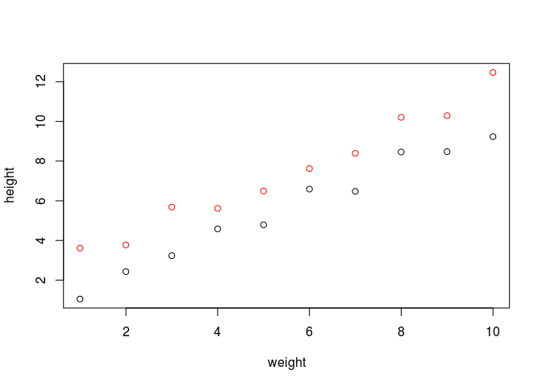
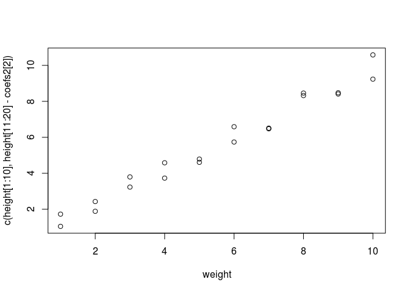
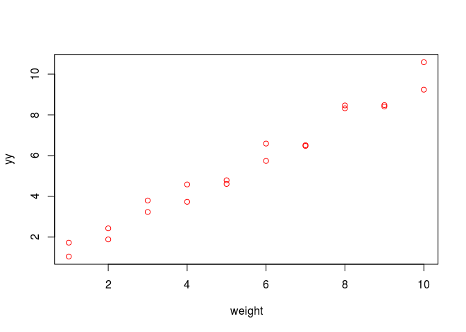
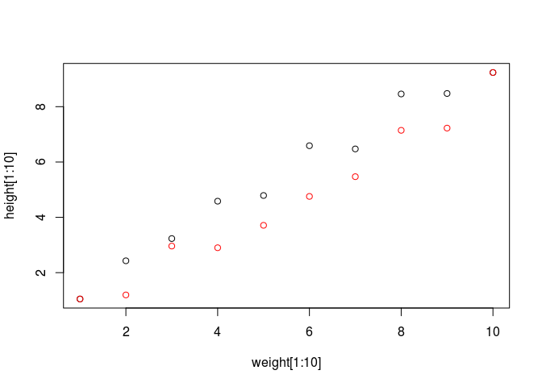

# Controlling Confounds
Takanori Watanabe  
Nov 1, 2016  


Demo from http://stats.stackexchange.com/questions/3944/explain-model-adjustment-in-plain-english

# Set seed


```r
# set seed ----------------------------------------------------------------
set.seed(69)
```

# set variables


```r
# set variables -----------------------------------------------------------
# x = weight, y = height
weight <- rep(1:10,2)
height <- c(jitter(1:10, factor=4), (jitter(1:10, factor=4)+2))
sex <- rep(c("f", "m"), each=10)
df1 <- data.frame(weight,height,sex)
```

# regression


```r
with(df1, plot(height~weight, col=c(1,2)[sex]))
```

<!-- -->

## lm1: without controlling for weight(weight)
(so according to this result, gender has no impact on height...which likely isn't true)


```r
lm1 <- lm(height~sex, data=df1)
anova(lm1); 
```

```
## Analysis of Variance Table
## 
## Response: height
##           Df Sum Sq Mean Sq F value Pr(>F)
## sex        1  17.73 17.7301  2.1734 0.1577
## Residuals 18 146.84  8.1578
```

```r
summary(lm1)
```

```
## 
## Call:
## lm(formula = height ~ sex, data = df1)
## 
## Residuals:
##     Min      1Q  Median      3Q     Max 
## -4.4832 -1.9247 -0.2676  2.8126  5.0501 
## 
## Coefficients:
##             Estimate Std. Error t value Pr(>|t|)    
## (Intercept)   5.5324     0.9032   6.125 8.73e-06 ***
## sexm          1.8831     1.2773   1.474    0.158    
## ---
## Signif. codes:  0 '***' 0.001 '**' 0.01 '*' 0.05 '.' 0.1 ' ' 1
## 
## Residual standard error: 2.856 on 18 degrees of freedom
## Multiple R-squared:  0.1077,	Adjusted R-squared:  0.05817 
## F-statistic: 2.173 on 1 and 18 DF,  p-value: 0.1577
```

```r
# lm1 <- lm(height~weight, data=df1)
```

## lm2: here we control for weight 
(now gender should have an effect on height as expected)


```r
lm2 <- lm(height~sex+weight, data=df1)

anova(lm2);
```

```
## Analysis of Variance Table
## 
## Response: height
##           Df  Sum Sq Mean Sq F value    Pr(>F)    
## sex        1  17.730  17.730  75.242 1.193e-07 ***
## weight     1 142.834 142.834 606.146 9.784e-15 ***
## Residuals 17   4.006   0.236                      
## ---
## Signif. codes:  0 '***' 0.001 '**' 0.01 '*' 0.05 '.' 0.1 ' ' 1
```

```r
summary(lm2)
```

```
## 
## Call:
## lm(formula = height ~ sex + weight, data = df1)
## 
## Residuals:
##     Min      1Q  Median      3Q     Max 
## -0.4840 -0.3921 -0.2676  0.4519  0.8633 
## 
## Coefficients:
##             Estimate Std. Error t value Pr(>|t|)    
## (Intercept)  0.41520    0.25839   1.607    0.126    
## sexm         1.88309    0.21709   8.674 1.19e-07 ***
## weight       0.93041    0.03779  24.620 9.78e-15 ***
## ---
## Signif. codes:  0 '***' 0.001 '**' 0.01 '*' 0.05 '.' 0.1 ' ' 1
## 
## Residual standard error: 0.4854 on 17 degrees of freedom
## Multiple R-squared:  0.9757,	Adjusted R-squared:  0.9728 
## F-statistic: 340.7 on 2 and 17 DF,  p-value: 1.923e-14
```

## In case you want to add the fitted lines to the plot


```r
coefs2 <- coef(lm2)
# abline(coefs2[1], coefs2[3], col=1)
# abline(coefs2[1]+coefs2[2], coefs2[3], col=2)

# below dash controls table header level
```

```r
# Try test --------------------------------------------------------------------


plot(weight,c(height[1:10],height[11:20] - coefs2[2]))
```

<!-- -->

```r
yy = c(height[1:10],height[-(1:10)] - coefs2[2])
plot(weight,yy,col='red')
```

<!-- -->

```r
plot(weight[1:10],height[1:10],ylim=range(c(0,12)))
par(new=TRUE)
plot(weight[-(1:10)],height[-(1:10)] - coefs2[2],col='red',axes=FALSE,xlab="",ylab="",ylim=range(c(0,12)))
```

<!-- -->

```r
plot(weight[1:10],height[1:10])
par(new=TRUE)
plot(weight[-(1:10)],height[-(1:10)],col='red',axes=FALSE,xlab="",ylab="")
```

<!-- -->


---
title: "control_var.R"
author: "takanori"
date: "Wed Nov  2 20:45:06 2016"
---
