# Introduction to Data Science with R


R codes from the Youtube tutorial from Dave Langer.
https://github.com/EasyD/IntroToDataScience


```r
options(show.error.locations = TRUE)

#
# This R source code file corresponds to video 7 of the YouTube series
# "Introduction to Data Science with R" located at the following URL:
#     https://youtu.be/fuB7s19g3nQ     
#
```

# Video1 - Data Analysis Part 1
https://www.youtube.com/watch?v=32o0DnuRjfg


```r
# Video1 - Data Analysis Part 1 ----

# Load raw data
train <- read.csv("train.csv", header = TRUE)
test <- read.csv("test.csv", header = TRUE)
```

```r
print(xtable::xtable(head(train,n=10)), type='html')
```

<!-- html table generated in R 3.3.1 by xtable 1.8-2 package -->
<!-- Sat Nov 05 18:23:56 2016 -->
<table border=1>
<tr> <th>  </th> <th> survived </th> <th> pclass </th> <th> name </th> <th> sex </th> <th> age </th> <th> sibsp </th> <th> parch </th> <th> ticket </th> <th> fare </th> <th> cabin </th> <th> embarked </th>  </tr>
  <tr> <td align="right"> 1 </td> <td align="right">   0 </td> <td align="right">   3 </td> <td> Braund, Mr. Owen Harris </td> <td> male </td> <td align="right"> 22.00 </td> <td align="right">   1 </td> <td align="right">   0 </td> <td> A/5 21171 </td> <td align="right"> 7.25 </td> <td>  </td> <td> S </td> </tr>
  <tr> <td align="right"> 2 </td> <td align="right">   1 </td> <td align="right">   1 </td> <td> Cumings, Mrs. John Bradley (Florence Briggs Thayer) </td> <td> female </td> <td align="right"> 38.00 </td> <td align="right">   1 </td> <td align="right">   0 </td> <td> PC 17599 </td> <td align="right"> 71.28 </td> <td> C85 </td> <td> C </td> </tr>
  <tr> <td align="right"> 3 </td> <td align="right">   1 </td> <td align="right">   3 </td> <td> Heikkinen, Miss. Laina </td> <td> female </td> <td align="right"> 26.00 </td> <td align="right">   0 </td> <td align="right">   0 </td> <td> STON/O2. 3101282 </td> <td align="right"> 7.92 </td> <td>  </td> <td> S </td> </tr>
  <tr> <td align="right"> 4 </td> <td align="right">   1 </td> <td align="right">   1 </td> <td> Futrelle, Mrs. Jacques Heath (Lily May Peel) </td> <td> female </td> <td align="right"> 35.00 </td> <td align="right">   1 </td> <td align="right">   0 </td> <td> 113803 </td> <td align="right"> 53.10 </td> <td> C123 </td> <td> S </td> </tr>
  <tr> <td align="right"> 5 </td> <td align="right">   0 </td> <td align="right">   3 </td> <td> Allen, Mr. William Henry </td> <td> male </td> <td align="right"> 35.00 </td> <td align="right">   0 </td> <td align="right">   0 </td> <td> 373450 </td> <td align="right"> 8.05 </td> <td>  </td> <td> S </td> </tr>
  <tr> <td align="right"> 6 </td> <td align="right">   0 </td> <td align="right">   3 </td> <td> Moran, Mr. James </td> <td> male </td> <td align="right">  </td> <td align="right">   0 </td> <td align="right">   0 </td> <td> 330877 </td> <td align="right"> 8.46 </td> <td>  </td> <td> Q </td> </tr>
  <tr> <td align="right"> 7 </td> <td align="right">   0 </td> <td align="right">   1 </td> <td> McCarthy, Mr. Timothy J </td> <td> male </td> <td align="right"> 54.00 </td> <td align="right">   0 </td> <td align="right">   0 </td> <td> 17463 </td> <td align="right"> 51.86 </td> <td> E46 </td> <td> S </td> </tr>
  <tr> <td align="right"> 8 </td> <td align="right">   0 </td> <td align="right">   3 </td> <td> Palsson, Master. Gosta Leonard </td> <td> male </td> <td align="right"> 2.00 </td> <td align="right">   3 </td> <td align="right">   1 </td> <td> 349909 </td> <td align="right"> 21.07 </td> <td>  </td> <td> S </td> </tr>
  <tr> <td align="right"> 9 </td> <td align="right">   1 </td> <td align="right">   3 </td> <td> Johnson, Mrs. Oscar W (Elisabeth Vilhelmina Berg) </td> <td> female </td> <td align="right"> 27.00 </td> <td align="right">   0 </td> <td align="right">   2 </td> <td> 347742 </td> <td align="right"> 11.13 </td> <td>  </td> <td> S </td> </tr>
  <tr> <td align="right"> 10 </td> <td align="right">   1 </td> <td align="right">   2 </td> <td> Nasser, Mrs. Nicholas (Adele Achem) </td> <td> female </td> <td align="right"> 14.00 </td> <td align="right">   1 </td> <td align="right">   0 </td> <td> 237736 </td> <td align="right"> 30.07 </td> <td>  </td> <td> C </td> </tr>
   </table>

```r
print(xtable::xtable(head(test,n=10)), type='html')
```

<!-- html table generated in R 3.3.1 by xtable 1.8-2 package -->
<!-- Sat Nov 05 18:23:56 2016 -->
<table border=1>
<tr> <th>  </th> <th> pclass </th> <th> name </th> <th> sex </th> <th> age </th> <th> sibsp </th> <th> parch </th> <th> ticket </th> <th> fare </th> <th> cabin </th> <th> embarked </th>  </tr>
  <tr> <td align="right"> 1 </td> <td align="right">   3 </td> <td> Kelly, Mr. James </td> <td> male </td> <td align="right"> 34.50 </td> <td align="right">   0 </td> <td align="right">   0 </td> <td> 330911 </td> <td align="right"> 7.83 </td> <td>  </td> <td> Q </td> </tr>
  <tr> <td align="right"> 2 </td> <td align="right">   3 </td> <td> Wilkes, Mrs. James (Ellen Needs) </td> <td> female </td> <td align="right"> 47.00 </td> <td align="right">   1 </td> <td align="right">   0 </td> <td> 363272 </td> <td align="right"> 7.00 </td> <td>  </td> <td> S </td> </tr>
  <tr> <td align="right"> 3 </td> <td align="right">   2 </td> <td> Myles, Mr. Thomas Francis </td> <td> male </td> <td align="right"> 62.00 </td> <td align="right">   0 </td> <td align="right">   0 </td> <td> 240276 </td> <td align="right"> 9.69 </td> <td>  </td> <td> Q </td> </tr>
  <tr> <td align="right"> 4 </td> <td align="right">   3 </td> <td> Wirz, Mr. Albert </td> <td> male </td> <td align="right"> 27.00 </td> <td align="right">   0 </td> <td align="right">   0 </td> <td> 315154 </td> <td align="right"> 8.66 </td> <td>  </td> <td> S </td> </tr>
  <tr> <td align="right"> 5 </td> <td align="right">   3 </td> <td> Hirvonen, Mrs. Alexander (Helga E Lindqvist) </td> <td> female </td> <td align="right"> 22.00 </td> <td align="right">   1 </td> <td align="right">   1 </td> <td> 3101298 </td> <td align="right"> 12.29 </td> <td>  </td> <td> S </td> </tr>
  <tr> <td align="right"> 6 </td> <td align="right">   3 </td> <td> Svensson, Mr. Johan Cervin </td> <td> male </td> <td align="right"> 14.00 </td> <td align="right">   0 </td> <td align="right">   0 </td> <td> 7538 </td> <td align="right"> 9.22 </td> <td>  </td> <td> S </td> </tr>
  <tr> <td align="right"> 7 </td> <td align="right">   3 </td> <td> Connolly, Miss. Kate </td> <td> female </td> <td align="right"> 30.00 </td> <td align="right">   0 </td> <td align="right">   0 </td> <td> 330972 </td> <td align="right"> 7.63 </td> <td>  </td> <td> Q </td> </tr>
  <tr> <td align="right"> 8 </td> <td align="right">   2 </td> <td> Caldwell, Mr. Albert Francis </td> <td> male </td> <td align="right"> 26.00 </td> <td align="right">   1 </td> <td align="right">   1 </td> <td> 248738 </td> <td align="right"> 29.00 </td> <td>  </td> <td> S </td> </tr>
  <tr> <td align="right"> 9 </td> <td align="right">   3 </td> <td> Abrahim, Mrs. Joseph (Sophie Halaut Easu) </td> <td> female </td> <td align="right"> 18.00 </td> <td align="right">   0 </td> <td align="right">   0 </td> <td> 2657 </td> <td align="right"> 7.23 </td> <td>  </td> <td> C </td> </tr>
  <tr> <td align="right"> 10 </td> <td align="right">   3 </td> <td> Davies, Mr. John Samuel </td> <td> male </td> <td align="right"> 21.00 </td> <td align="right">   2 </td> <td align="right">   0 </td> <td> A/4 48871 </td> <td align="right"> 24.15 </td> <td>  </td> <td> S </td> </tr>
   </table>

```r
# Add a "Survived" variable to the test set to allow for combining data sets
test.survived <- data.frame(survived = rep("None", nrow(test)), test[,])

# Combine data sets
data.combined <- rbind(train, test.survived)

# A bit about R data types (e.g., factors)
str(data.combined)
```

'data.frame':	1309 obs. of  11 variables:
 $ survived: chr  "0" "1" "1" "1" ...
 $ pclass  : int  3 1 3 1 3 3 1 3 3 2 ...
 $ name    : Factor w/ 1307 levels "Abbing, Mr. Anthony",..: 109 191 358 277 16 559 520 629 417 581 ...
 $ sex     : Factor w/ 2 levels "female","male": 2 1 1 1 2 2 2 2 1 1 ...
 $ age     : num  22 38 26 35 35 NA 54 2 27 14 ...
 $ sibsp   : int  1 1 0 1 0 0 0 3 0 1 ...
 $ parch   : int  0 0 0 0 0 0 0 1 2 0 ...
 $ ticket  : Factor w/ 929 levels "110152","110413",..: 524 597 670 50 473 276 86 396 345 133 ...
 $ fare    : num  7.25 71.28 7.92 53.1 8.05 ...
 $ cabin   : Factor w/ 187 levels "","A10","A14",..: 1 83 1 57 1 1 131 1 1 1 ...
 $ embarked: Factor w/ 4 levels "","C","Q","S": 4 2 4 4 4 3 4 4 4 2 ...

```r
data.combined$survived <- as.factor(data.combined$survived)
data.combined$pclass <- as.factor(data.combined$pclass)

# Take a look at gross survival rates
table(data.combined$survived)
```


   0    1 None 
 549  342  418 

```r
# Distribution across classes
table(data.combined$pclass)
```


  1   2   3 
323 277 709 

```r
# Load up ggplot2 package to use for visualizations
library(ggplot2)


# Hypothesis - Rich folks survived at a higer rate
train$pclass <- as.factor(train$pclass)
ggplot(train, aes(x = pclass, fill = factor(survived))) +
  geom_bar() +
  xlab("Pclass") +
  ylab("Total Count") +
  labs(fill = "Survived") 
```

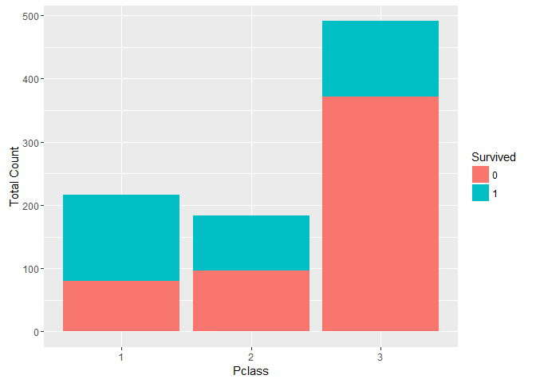<!-- -->

```r
# Examine the first few names in the training data set
head(as.character(train$name))
```

[1] "Braund, Mr. Owen Harris"                            
[2] "Cumings, Mrs. John Bradley (Florence Briggs Thayer)"
[3] "Heikkinen, Miss. Laina"                             
[4] "Futrelle, Mrs. Jacques Heath (Lily May Peel)"       
[5] "Allen, Mr. William Henry"                           
[6] "Moran, Mr. James"                                   

```r
# How many unique names are there across both train & test?
length(unique(as.character(data.combined$name)))
```

[1] 1307

```r
# Two duplicate names, take a closer look
# First, get the duplicate names and store them as a vector
dup.names <- as.character(data.combined[which(duplicated(as.character(data.combined$name))), "name"])

# Next, take a look at the records in the combined data set
data.combined[which(data.combined$name %in% dup.names),]
```

    survived pclass                 name    sex  age sibsp parch ticket
290        1      3 Connolly, Miss. Kate female 22.0     0     0 370373
697        0      3     Kelly, Mr. James   male 44.0     0     0 363592
892     None      3     Kelly, Mr. James   male 34.5     0     0 330911
898     None      3 Connolly, Miss. Kate female 30.0     0     0 330972
      fare cabin embarked
290 7.7500              Q
697 8.0500              S
892 7.8292              Q
898 7.6292              Q

```r
# What is up with the 'Miss.' and 'Mr.' thing?
library(stringr)

# Any correlation with other variables (e.g., sibsp)?
misses <- data.combined[which(str_detect(data.combined$name, "Miss.")),]
misses[1:5,]
```

   survived pclass                                 name    sex age sibsp
3         1      3               Heikkinen, Miss. Laina female  26     0
11        1      3      Sandstrom, Miss. Marguerite Rut female   4     1
12        1      1             Bonnell, Miss. Elizabeth female  58     0
15        0      3 Vestrom, Miss. Hulda Amanda Adolfina female  14     0
23        1      3          McGowan, Miss. Anna "Annie" female  15     0
   parch           ticket    fare cabin embarked
3      0 STON/O2. 3101282  7.9250              S
11     1          PP 9549 16.7000    G6        S
12     0           113783 26.5500  C103        S
15     0           350406  7.8542              S
23     0           330923  8.0292              Q

```r
# Hypothesis - Name titles correlate with age
mrses <- data.combined[which(str_detect(data.combined$name, "Mrs.")), ]
mrses[1:5,]
```

   survived pclass                                                name
2         1      1 Cumings, Mrs. John Bradley (Florence Briggs Thayer)
4         1      1        Futrelle, Mrs. Jacques Heath (Lily May Peel)
9         1      3   Johnson, Mrs. Oscar W (Elisabeth Vilhelmina Berg)
10        1      2                 Nasser, Mrs. Nicholas (Adele Achem)
16        1      2                    Hewlett, Mrs. (Mary D Kingcome) 
      sex age sibsp parch   ticket    fare cabin embarked
2  female  38     1     0 PC 17599 71.2833   C85        C
4  female  35     1     0   113803 53.1000  C123        S
9  female  27     0     2   347742 11.1333              S
10 female  14     1     0   237736 30.0708              C
16 female  55     0     0   248706 16.0000              S

```r
# Check out males to see if pattern continues
males <- data.combined[which(train$sex == "male"), ]
males[1:5,]
```

  survived pclass                           name  sex age sibsp parch
1        0      3        Braund, Mr. Owen Harris male  22     1     0
5        0      3       Allen, Mr. William Henry male  35     0     0
6        0      3               Moran, Mr. James male  NA     0     0
7        0      1        McCarthy, Mr. Timothy J male  54     0     0
8        0      3 Palsson, Master. Gosta Leonard male   2     3     1
     ticket    fare cabin embarked
1 A/5 21171  7.2500              S
5    373450  8.0500              S
6    330877  8.4583              Q
7     17463 51.8625   E46        S
8    349909 21.0750              S

```r
# Expand upon the realtionship between `Survived` and `Pclass` by adding the new `Title` variable to the
# data set and then explore a potential 3-dimensional relationship.

# Create a utility function to help with title extraction
extractTitle <- function(name) {
  name <- as.character(name)
  
  if (length(grep("Miss.", name)) > 0) {
    return ("Miss.")
  } else if (length(grep("Master.", name)) > 0) {
    return ("Master.")
  } else if (length(grep("Mrs.", name)) > 0) {
    return ("Mrs.")
  } else if (length(grep("Mr.", name)) > 0) {
    return ("Mr.")
  } else {
    return ("Other")
  }
}

titles <- NULL
for (i in 1:nrow(data.combined)) {
  titles <- c(titles, extractTitle(data.combined[i,"name"]))
}
data.combined$title <- as.factor(titles)

# Since we only have survived lables for the train set, only use the
# first 891 rows
ggplot(data.combined[1:891,], aes(x = title, fill = survived)) +
  geom_bar() +
  facet_wrap(~pclass) + 
  ggtitle("Pclass") +
  xlab("Title") +
  ylab("Total Count") +
  labs(fill = "Survived")
```

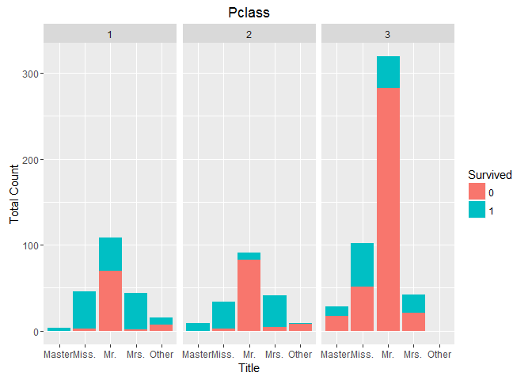<!-- -->

# Video2 - Data Analysis Part 2
https://www.youtube.com/watch?v=u6sahb7Hmog


```r
# Video2 - Data Analysis Part 2 ----
# What's the distribution of females to males across train & test?
table(data.combined$sex)
```

```
## 
## female   male 
##    466    843
```

```r
# Visualize the 3-way relationship of sex, pclass, and survival, compare to analysis of title
ggplot(data.combined[1:891,], aes(x = sex, fill = survived)) +
  geom_bar() +
  facet_wrap(~pclass) + 
  ggtitle("Pclass") +
  xlab("Sex") +
  ylab("Total Count") +
  labs(fill = "Survived")
```

<!-- -->

```r
# OK, age and sex seem pretty important as derived from analysis of title, let's take a closer 
# look at the distibutions of age over entire data set
summary(data.combined$age)
```

```
##    Min. 1st Qu.  Median    Mean 3rd Qu.    Max.    NA's 
##    0.17   21.00   28.00   29.88   39.00   80.00     263
```

```r
summary(data.combined[1:891,"age"])
```

```
##    Min. 1st Qu.  Median    Mean 3rd Qu.    Max.    NA's 
##    0.42   20.12   28.00   29.70   38.00   80.00     177
```

```r
# Just to be thorough, take a look at survival rates broken out by sex, pclass, and age
ggplot(data.combined[1:891,], aes(x = age, fill = survived)) +
  facet_wrap(~sex + pclass) +
  geom_histogram(binwidth = 10) +
  xlab("Age") +
  ylab("Total Count")
```

```
## Warning: Removed 177 rows containing non-finite values (stat_bin).
```

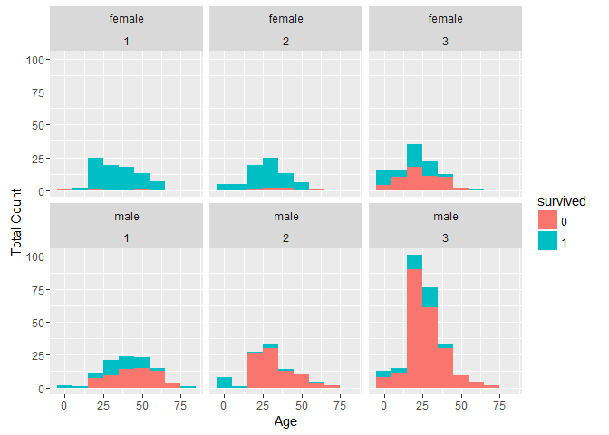<!-- -->

```r
# Validate that "Master." is a good proxy for male children
boys <- data.combined[which(data.combined$title == "Master."),]
summary(boys$age)
```

```
##    Min. 1st Qu.  Median    Mean 3rd Qu.    Max.    NA's 
##   0.330   2.000   4.000   5.483   9.000  14.500       8
```

```r
# We know that "Miss." is more complicated, let's examine further
misses <- data.combined[which(data.combined$title == "Miss."),]
summary(misses$age)
```

```
##    Min. 1st Qu.  Median    Mean 3rd Qu.    Max.    NA's 
##    0.17   15.00   22.00   21.77   30.00   63.00      50
```

```r
ggplot(misses[misses$survived != "None" & !is.na(misses$age),], aes(x = age, fill = survived)) +
  facet_wrap(~pclass) +
  geom_histogram(binwidth = 5) +
  ggtitle("Age for 'Miss.' by Pclass") + 
  xlab("Age") +
  ylab("Total Count")
```

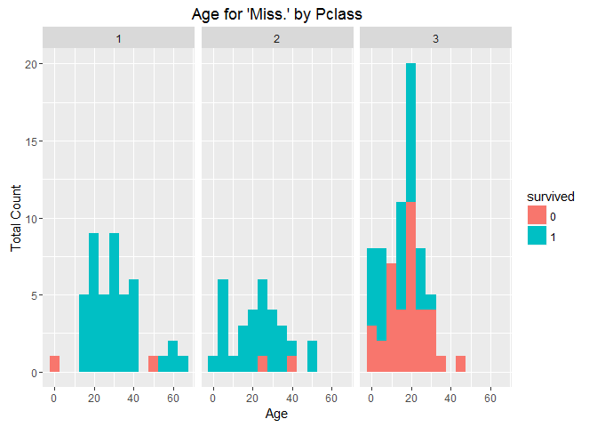<!-- -->

```r
# OK, appears female children may have different survival rate, 
# could be a candidate for feature engineering later
misses.alone <- misses[which(misses$sibsp == 0 & misses$parch == 0),]
summary(misses.alone$age)
```

```
##    Min. 1st Qu.  Median    Mean 3rd Qu.    Max.    NA's 
##    5.00   21.00   26.00   27.23   32.50   58.00      33
```

```r
length(which(misses.alone$age <= 14.5))
```

```
## [1] 4
```

```r
# Move on to the sibsp variable, summarize the variable
summary(data.combined$sibsp)
```

```
##    Min. 1st Qu.  Median    Mean 3rd Qu.    Max. 
##  0.0000  0.0000  0.0000  0.4989  1.0000  8.0000
```

```r
# Can we treat as a factor?
length(unique(data.combined$sibsp))
```

```
## [1] 7
```

```r
data.combined$sibsp <- as.factor(data.combined$sibsp)


# We believe title is predictive. Visualize survival reates by sibsp, pclass, and title
ggplot(data.combined[1:891,], aes(x = sibsp, fill = survived)) +
  geom_bar() +
  facet_wrap(~pclass + title) + 
  ggtitle("Pclass, Title") +
  xlab("SibSp") +
  ylab("Total Count") +
  ylim(0,300) +
  labs(fill = "Survived")
```

<!-- -->

```r
# Treat the parch vaiable as a factor and visualize
data.combined$parch <- as.factor(data.combined$parch)
ggplot(data.combined[1:891,], aes(x = parch, fill = survived)) +
  geom_bar() +
  facet_wrap(~pclass + title) + 
  ggtitle("Pclass, Title") +
  xlab("ParCh") +
  ylab("Total Count") +
  ylim(0,300) +
  labs(fill = "Survived")
```

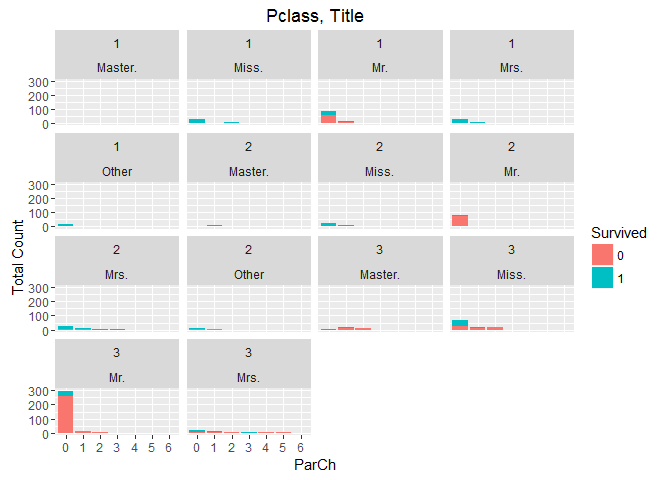<!-- -->

```r
# Let's try some feature engineering. What about creating a family size feature?
temp.sibsp <- c(train$sibsp, test$sibsp)
temp.parch <- c(train$parch, test$parch)
data.combined$family.size <- as.factor(temp.sibsp + temp.parch + 1)


# Visualize it to see if it is predictive
ggplot(data.combined[1:891,], aes(x = family.size, fill = survived)) +
  geom_bar() +
  facet_wrap(~pclass + title) + 
  ggtitle("Pclass, Title") +
  xlab("family.size") +
  ylab("Total Count") +
  ylim(0,300) +
  labs(fill = "Survived")
```

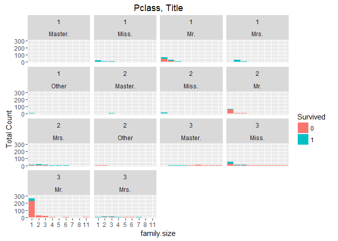<!-- -->

# Video3 - Data Analysis Part 3
https://www.youtube.com/watch?v=aMV_6LmCs4Q


```r
# Video3 - Data Analysis Part 3 ----

# Take a look at the ticket variable
str(data.combined$ticket)
```

```
##  Factor w/ 929 levels "110152","110413",..: 524 597 670 50 473 276 86 396 345 133 ...
```

```r
# Based on the huge number of levels ticket really isn't a factor variable it is a string. 
# Convert it and display first 20
data.combined$ticket <- as.character(data.combined$ticket)
data.combined$ticket[1:20]
```

```
##  [1] "A/5 21171"        "PC 17599"         "STON/O2. 3101282"
##  [4] "113803"           "373450"           "330877"          
##  [7] "17463"            "349909"           "347742"          
## [10] "237736"           "PP 9549"          "113783"          
## [13] "A/5. 2151"        "347082"           "350406"          
## [16] "248706"           "382652"           "244373"          
## [19] "345763"           "2649"
```

```r
# There's no immediately apparent structure in the data, let's see if we can find some.
# We'll start with taking a look at just the first char for each
ticket.first.char <- ifelse(data.combined$ticket == "", " ", substr(data.combined$ticket, 1, 1))
unique(ticket.first.char)
```

```
##  [1] "A" "P" "S" "1" "3" "2" "C" "7" "W" "4" "F" "L" "9" "6" "5" "8"
```

```r
# OK, we can make a factor for analysis purposes and visualize
data.combined$ticket.first.char <- as.factor(ticket.first.char)

# First, a high-level plot of the data
ggplot(data.combined[1:891,], aes(x = ticket.first.char, fill = survived)) +
  geom_bar() +
  ggtitle("Survivability by ticket.first.char") +
  xlab("ticket.first.char") +
  ylab("Total Count") +
  ylim(0,350) +
  labs(fill = "Survived")
```

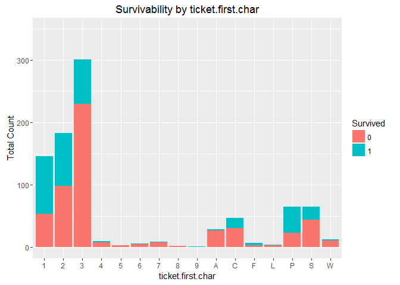<!-- -->

```r
# Ticket seems like it might be predictive, drill down a bit
ggplot(data.combined[1:891,], aes(x = ticket.first.char, fill = survived)) +
  geom_bar() +
  facet_wrap(~pclass) + 
  ggtitle("Pclass") +
  xlab("ticket.first.char") +
  ylab("Total Count") +
  ylim(0,150) +
  labs(fill = "Survived")
```

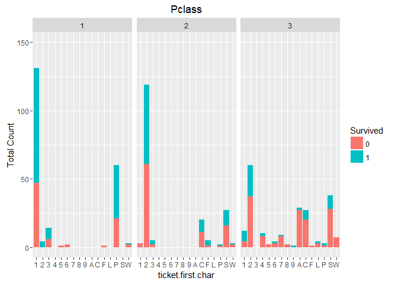<!-- -->

```r
# Lastly, see if we get a pattern when using combination of pclass & title
ggplot(data.combined[1:891,], aes(x = ticket.first.char, fill = survived)) +
  geom_bar() +
  facet_wrap(~pclass + title) + 
  ggtitle("Pclass, Title") +
  xlab("ticket.first.char") +
  ylab("Total Count") +
  ylim(0,200) +
  labs(fill = "Survived")
```

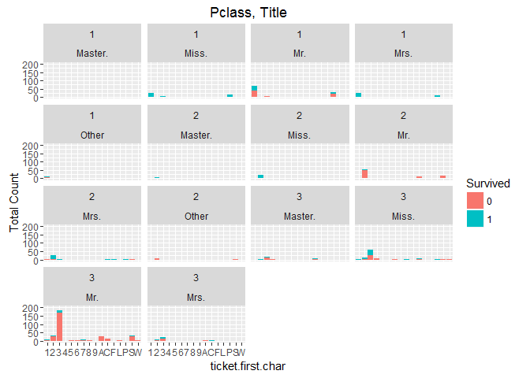<!-- -->

```r
# Next up - the fares Titanic passengers paid
summary(data.combined$fare)
```

```
##    Min. 1st Qu.  Median    Mean 3rd Qu.    Max.    NA's 
##   0.000   7.896  14.450  33.300  31.280 512.300       1
```

```r
length(unique(data.combined$fare))
```

```
## [1] 282
```

```r
# Can't make fare a factor, treat as numeric & visualize with histogram
ggplot(data.combined, aes(x = fare)) +
  geom_histogram(binwidth = 5) +
  ggtitle("Combined Fare Distribution") +
  xlab("Fare") +
  ylab("Total Count") +
  ylim(0,200)
```

```
## Warning: Removed 1 rows containing non-finite values (stat_bin).
```

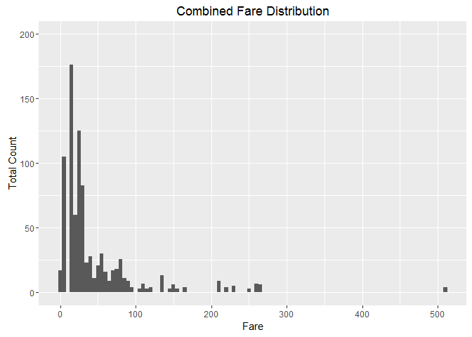<!-- -->

```r
# Let's check to see if fare has predictive power
ggplot(data.combined[1:891,], aes(x = fare, fill = survived)) +
  geom_histogram(binwidth = 5) +
  facet_wrap(~pclass + title) + 
  ggtitle("Pclass, Title") +
  xlab("fare") +
  ylab("Total Count") +
  ylim(0,50) + 
  labs(fill = "Survived")
```

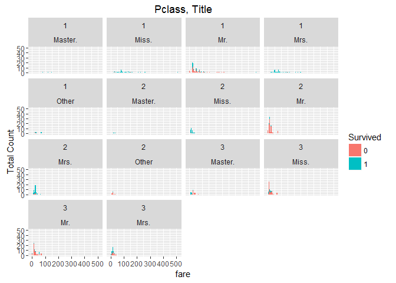<!-- -->

```r
# Analysis of the cabin variable
str(data.combined$cabin)
```

```
##  Factor w/ 187 levels "","A10","A14",..: 1 83 1 57 1 1 131 1 1 1 ...
```

```r
# Cabin really isn't a factor, make a string and the display first 100
data.combined$cabin <- as.character(data.combined$cabin)
data.combined$cabin[1:100]
```

```
##   [1] ""            "C85"         ""            "C123"        ""           
##   [6] ""            "E46"         ""            ""            ""           
##  [11] "G6"          "C103"        ""            ""            ""           
##  [16] ""            ""            ""            ""            ""           
##  [21] ""            "D56"         ""            "A6"          ""           
##  [26] ""            ""            "C23 C25 C27" ""            ""           
##  [31] ""            "B78"         ""            ""            ""           
##  [36] ""            ""            ""            ""            ""           
##  [41] ""            ""            ""            ""            ""           
##  [46] ""            ""            ""            ""            ""           
##  [51] ""            ""            "D33"         ""            "B30"        
##  [56] "C52"         ""            ""            ""            ""           
##  [61] ""            "B28"         "C83"         ""            ""           
##  [66] ""            "F33"         ""            ""            ""           
##  [71] ""            ""            ""            ""            ""           
##  [76] "F G73"       ""            ""            ""            ""           
##  [81] ""            ""            ""            ""            ""           
##  [86] ""            ""            ""            "C23 C25 C27" ""           
##  [91] ""            ""            "E31"         ""            ""           
##  [96] ""            "A5"          "D10 D12"     ""            ""
```

```r
# Replace empty cabins with a "U"
data.combined[which(data.combined$cabin == ""), "cabin"] <- "U"
data.combined$cabin[1:100]
```

```
##   [1] "U"           "C85"         "U"           "C123"        "U"          
##   [6] "U"           "E46"         "U"           "U"           "U"          
##  [11] "G6"          "C103"        "U"           "U"           "U"          
##  [16] "U"           "U"           "U"           "U"           "U"          
##  [21] "U"           "D56"         "U"           "A6"          "U"          
##  [26] "U"           "U"           "C23 C25 C27" "U"           "U"          
##  [31] "U"           "B78"         "U"           "U"           "U"          
##  [36] "U"           "U"           "U"           "U"           "U"          
##  [41] "U"           "U"           "U"           "U"           "U"          
##  [46] "U"           "U"           "U"           "U"           "U"          
##  [51] "U"           "U"           "D33"         "U"           "B30"        
##  [56] "C52"         "U"           "U"           "U"           "U"          
##  [61] "U"           "B28"         "C83"         "U"           "U"          
##  [66] "U"           "F33"         "U"           "U"           "U"          
##  [71] "U"           "U"           "U"           "U"           "U"          
##  [76] "F G73"       "U"           "U"           "U"           "U"          
##  [81] "U"           "U"           "U"           "U"           "U"          
##  [86] "U"           "U"           "U"           "C23 C25 C27" "U"          
##  [91] "U"           "U"           "E31"         "U"           "U"          
##  [96] "U"           "A5"          "D10 D12"     "U"           "U"
```

```r
# Take a look at just the first char as a factor
cabin.first.char <- as.factor(substr(data.combined$cabin, 1, 1))
str(cabin.first.char)
```

```
##  Factor w/ 9 levels "A","B","C","D",..: 9 3 9 3 9 9 5 9 9 9 ...
```

```r
levels(cabin.first.char)
```

```
## [1] "A" "B" "C" "D" "E" "F" "G" "T" "U"
```

```r
# Add to combined data set and plot 
data.combined$cabin.first.char <- cabin.first.char

# High level plot
ggplot(data.combined[1:891,], aes(x = cabin.first.char, fill = survived)) +
  geom_bar() +
  ggtitle("Survivability by cabin.first.char") +
  xlab("cabin.first.char") +
  ylab("Total Count") +
  ylim(0,750) +
  labs(fill = "Survived")
```

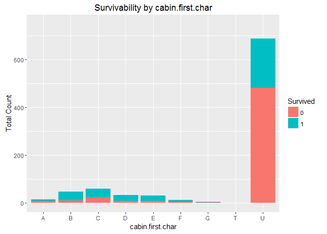<!-- -->

```r
# Could have some predictive power, drill in
ggplot(data.combined[1:891,], aes(x = cabin.first.char, fill = survived)) +
  geom_bar() +
  facet_wrap(~pclass) +
  ggtitle("Survivability by cabin.first.char") +
  xlab("Pclass") +
  ylab("Total Count") +
  ylim(0,500) +
  labs(fill = "Survived")
```

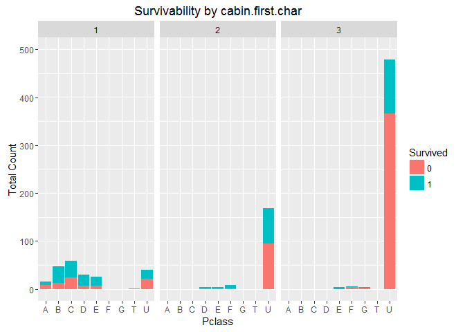<!-- -->

```r
# Does this feature improve upon pclass + title?
ggplot(data.combined[1:891,], aes(x = cabin.first.char, fill = survived)) +
  geom_bar() +
  facet_wrap(~pclass + title) +
  ggtitle("Pclass, Title") +
  xlab("cabin.first.char") +
  ylab("Total Count") +
  ylim(0,500) +
  labs(fill = "Survived")
```

<!-- -->

```r
# What about folks with multiple cabins?
data.combined$cabin.multiple <- as.factor(ifelse(str_detect(data.combined$cabin, " "), "Y", "N"))

ggplot(data.combined[1:891,], aes(x = cabin.multiple, fill = survived)) +
  geom_bar() +
  facet_wrap(~pclass + title) +
  ggtitle("Pclass, Title") +
  xlab("cabin.multiple") +
  ylab("Total Count") +
  ylim(0,350) +
  labs(fill = "Survived")
```

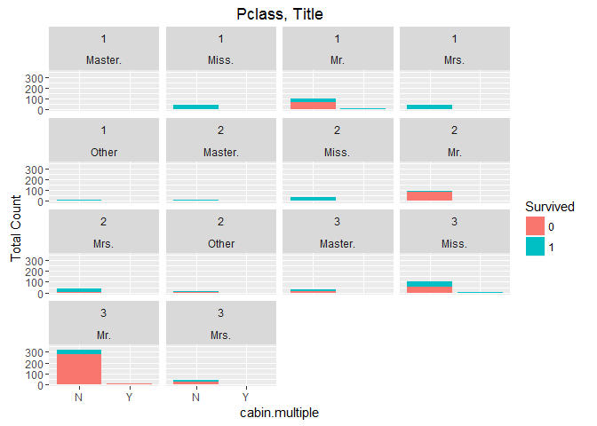<!-- -->

```r
# Does survivability depend on where you got onboard the Titanic?
str(data.combined$embarked)
```

```
##  Factor w/ 4 levels "","C","Q","S": 4 2 4 4 4 3 4 4 4 2 ...
```

```r
levels(data.combined$embarked)
```

```
## [1] ""  "C" "Q" "S"
```

```r
# Plot data for analysis
ggplot(data.combined[1:891,], aes(x = embarked, fill = survived)) +
  geom_bar() +
  facet_wrap(~pclass + title) +
  ggtitle("Pclass, Title") +
  xlab("embarked") +
  ylab("Total Count") +
  ylim(0,300) +
  labs(fill = "Survived")
```

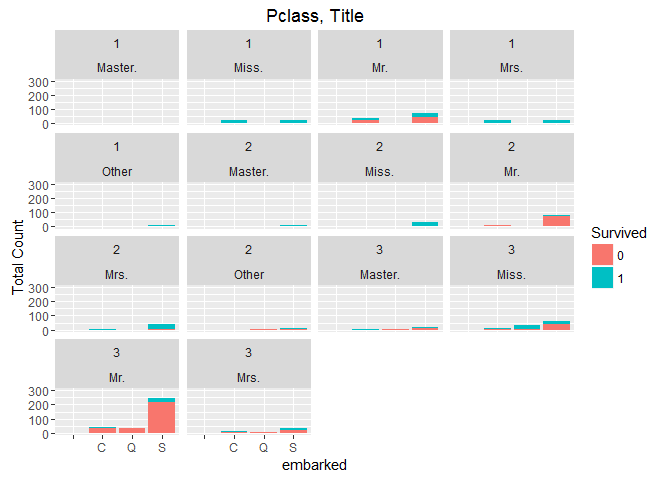<!-- -->

# Video4 - Exploratory Modeling (Random Forests)
https://www.youtube.com/watch?v=UHJH7w9q4Lc


```r
# Video4 - Exploratory Modeling ----

library(randomForest)
```

```
## Warning: package 'randomForest' was built under R version 3.3.2
```

```
## randomForest 4.6-12
```

```
## Type rfNews() to see new features/changes/bug fixes.
```

```
## 
## Attaching package: 'randomForest'
```

```
## The following object is masked from 'package:ggplot2':
## 
##     margin
```

## Train a Random Forest with the default parameters using pclass & title


```r
rf.train.1 <- data.combined[1:891, c("pclass", "title")]
rf.label <- as.factor(train$survived)

set.seed(1234)
rf.1 <- randomForest(x = rf.train.1, y = rf.label, importance = TRUE, ntree = 1000)
rf.1
```

```
## 
## Call:
##  randomForest(x = rf.train.1, y = rf.label, ntree = 1000, importance = TRUE) 
##                Type of random forest: classification
##                      Number of trees: 1000
## No. of variables tried at each split: 1
## 
##         OOB estimate of  error rate: 20.76%
## Confusion matrix:
##     0   1 class.error
## 0 538  11  0.02003643
## 1 174 168  0.50877193
```

```r
varImpPlot(rf.1)
```

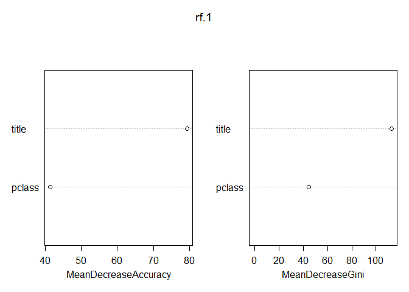<!-- -->

## Train a Random Forest using pclass, title, & sibsp


```r
rf.train.2 <- data.combined[1:891, c("pclass", "title", "sibsp")]

set.seed(1234)
rf.2 <- randomForest(x = rf.train.2, y = rf.label, importance = TRUE, ntree = 1000)
rf.2
```

```
## 
## Call:
##  randomForest(x = rf.train.2, y = rf.label, ntree = 1000, importance = TRUE) 
##                Type of random forest: classification
##                      Number of trees: 1000
## No. of variables tried at each split: 1
## 
##         OOB estimate of  error rate: 19.75%
## Confusion matrix:
##     0   1 class.error
## 0 487  62   0.1129326
## 1 114 228   0.3333333
```

```r
varImpPlot(rf.2)
```

<!-- -->

## Train a Random Forest using pclass, title, & parch


```r
rf.train.3 <- data.combined[1:891, c("pclass", "title", "parch")]

set.seed(1234)
rf.3 <- randomForest(x = rf.train.3, y = rf.label, importance = TRUE, ntree = 1000)
rf.3
```

```
## 
## Call:
##  randomForest(x = rf.train.3, y = rf.label, ntree = 1000, importance = TRUE) 
##                Type of random forest: classification
##                      Number of trees: 1000
## No. of variables tried at each split: 1
## 
##         OOB estimate of  error rate: 19.98%
## Confusion matrix:
##     0   1 class.error
## 0 495  54  0.09836066
## 1 124 218  0.36257310
```

```r
varImpPlot(rf.3)
```

<!-- -->

## Train a Random Forest using pclass, title, sibsp, parch


```r
rf.train.4 <- data.combined[1:891, c("pclass", "title", "sibsp", "parch")]

set.seed(1234)
rf.4 <- randomForest(x = rf.train.4, y = rf.label, importance = TRUE, ntree = 1000)
rf.4
```

```
## 
## Call:
##  randomForest(x = rf.train.4, y = rf.label, ntree = 1000, importance = TRUE) 
##                Type of random forest: classification
##                      Number of trees: 1000
## No. of variables tried at each split: 2
## 
##         OOB estimate of  error rate: 18.52%
## Confusion matrix:
##     0   1 class.error
## 0 489  60   0.1092896
## 1 105 237   0.3070175
```

```r
varImpPlot(rf.4)
```

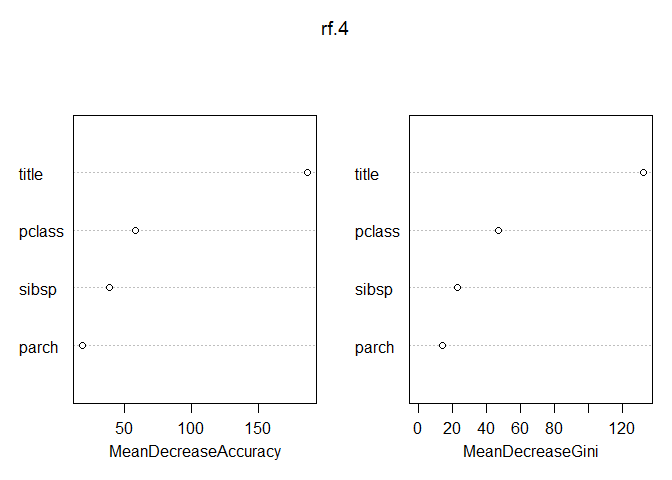<!-- -->

## Train a Random Forest using pclass, title, & family.size


```r
rf.train.5 <- data.combined[1:891, c("pclass", "title", "family.size")]

set.seed(1234)
rf.5 <- randomForest(x = rf.train.5, y = rf.label, importance = TRUE, ntree = 1000)
rf.5
```

```
## 
## Call:
##  randomForest(x = rf.train.5, y = rf.label, ntree = 1000, importance = TRUE) 
##                Type of random forest: classification
##                      Number of trees: 1000
## No. of variables tried at each split: 1
## 
##         OOB estimate of  error rate: 18.41%
## Confusion matrix:
##     0   1 class.error
## 0 485  64   0.1165756
## 1 100 242   0.2923977
```

```r
varImpPlot(rf.5)
```

<!-- -->

## Train a Random Forest using pclass, title, sibsp, & family.size


```r
rf.train.6 <- data.combined[1:891, c("pclass", "title", "sibsp", "family.size")]

set.seed(1234)
rf.6 <- randomForest(x = rf.train.6, y = rf.label, importance = TRUE, ntree = 1000)
rf.6
```

```
## 
## Call:
##  randomForest(x = rf.train.6, y = rf.label, ntree = 1000, importance = TRUE) 
##                Type of random forest: classification
##                      Number of trees: 1000
## No. of variables tried at each split: 2
## 
##         OOB estimate of  error rate: 18.74%
## Confusion matrix:
##     0   1 class.error
## 0 486  63   0.1147541
## 1 104 238   0.3040936
```

```r
varImpPlot(rf.6)
```

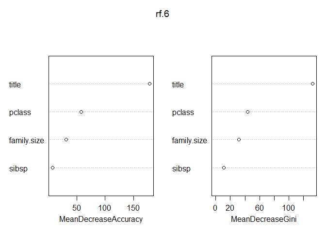<!-- -->

## Train a Random Forest using pclass, title, parch, & family.size


```r
rf.train.7 <- data.combined[1:891, c("pclass", "title", "parch", "family.size")]

set.seed(1234)
rf.7 <- randomForest(x = rf.train.7, y = rf.label, importance = TRUE, ntree = 1000)
rf.7
```

```
## 
## Call:
##  randomForest(x = rf.train.7, y = rf.label, ntree = 1000, importance = TRUE) 
##                Type of random forest: classification
##                      Number of trees: 1000
## No. of variables tried at each split: 2
## 
##         OOB estimate of  error rate: 18.97%
## Confusion matrix:
##     0   1 class.error
## 0 486  63   0.1147541
## 1 106 236   0.3099415
```

```r
varImpPlot(rf.7)
```

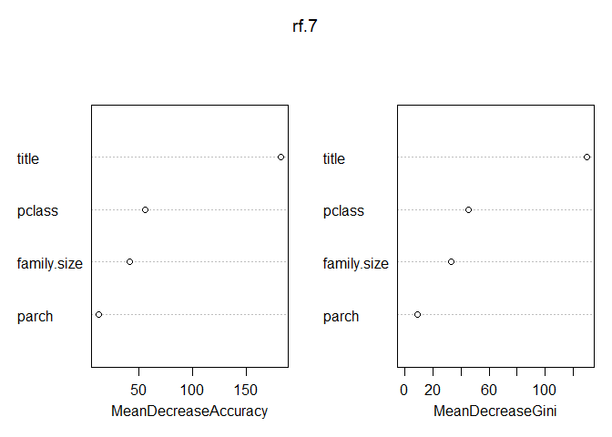<!-- -->

# Video5 - Cross Validation
https://www.youtube.com/watch?v=84JSk36og34


```r
# Video5 - Cross Validation ----


# Before we jump into features engineering we need to establish a methodology
# for estimating our error rate on the test set (i.e., unseen data). This is
# critical, for without this we are more likely to overfit. Let's start with a 
# submission of rf.5 to Kaggle to see if our OOB error estimate is accurate.

# Subset our test records and features
test.submit.df <- data.combined[892:1309, c("pclass", "title", "family.size")]

# Make predictions
rf.5.preds <- predict(rf.5, test.submit.df)
table(rf.5.preds)
```

```
## rf.5.preds
##   0   1 
## 258 160
```

```r
# Write out a CSV file for submission to Kaggle
submit.df <- data.frame(PassengerId = rep(892:1309), Survived = rf.5.preds)

write.csv(submit.df, file = "RF_SUB_20160215_1.csv", row.names = FALSE)

# Our submission scores 0.79426, but the OOB predicts that we should score 0.8159.
# Let's look into cross-validation using the caret package to see if we can get
# more accurate estimates
library(caret)
```

```
## Loading required package: lattice
```

```r
library(doSNOW)
```

```
## Warning: package 'doSNOW' was built under R version 3.3.2
```

```
## Loading required package: foreach
```

```
## Loading required package: iterators
```

```
## Loading required package: snow
```

```
## Warning: package 'snow' was built under R version 3.3.2
```

```r
# Research has shown that 10-fold CV repeated 10 times is the best place to start,
# however there are no hard and fast rules - this is where the experience of the 
# Data Scientist (i.e., the "art") comes into play. We'll start with 10-fold CV,
# repeated 10 times and see how it goes.


# Leverage caret to create 100 total folds, but ensure that the ratio of those
# that survived and perished in each fold matches the overall training set. This
# is known as stratified cross validation and generally provides better results.
set.seed(2348)
cv.10.folds <- createMultiFolds(rf.label, k = 10, times = 10)

# Check stratification
table(rf.label)
```

```
## rf.label
##   0   1 
## 549 342
```

```r
342 / 549
```

```
## [1] 0.6229508
```

```r
table(rf.label[cv.10.folds[[33]]])
```

```
## 
##   0   1 
## 494 308
```

```r
308 / 494
```

```
## [1] 0.6234818
```

```r
# Set up caret's trainControl object per above.
ctrl.1 <- trainControl(method = "repeatedcv", number = 10, repeats = 10,
                       index = cv.10.folds)


# Set up doSNOW package for multi-core training. This is helpful as we're going
# to be training a lot of trees.
# NOTE - This works on Windows and Mac, unlike doMC
cl <- makeCluster(6, type = "SOCK")
registerDoSNOW(cl)


# Set seed for reproducibility and train
set.seed(34324)
rf.5.cv.1 <- train(x = rf.train.5, y = rf.label, method = "rf", tuneLength = 3,
                   ntree = 1000, trControl = ctrl.1)
```

```
## note: only 2 unique complexity parameters in default grid. Truncating the grid to 2 .
```

```r
#Shutdown cluster
stopCluster(cl)

# Check out results
rf.5.cv.1
```

```
## Random Forest 
## 
## 891 samples
##   3 predictor
##   2 classes: '0', '1' 
## 
## No pre-processing
## Resampling: Cross-Validated (10 fold, repeated 10 times) 
## Summary of sample sizes: 801, 802, 802, 803, 802, 801, ... 
## Resampling results across tuning parameters:
## 
##   mtry  Accuracy   Kappa    
##   2     0.8121316  0.5929087
##   3     0.8089966  0.5852138
## 
## Accuracy was used to select the optimal model using  the largest value.
## The final value used for the model was mtry = 2.
```

```r
# The above is only slightly more pessimistic than the rf.5 OOB prediction, but 
# not pessimistic enough. Let's try 5-fold CV repeated 10 times.
set.seed(5983)
cv.5.folds <- createMultiFolds(rf.label, k = 5, times = 10)

ctrl.2 <- trainControl(method = "repeatedcv", number = 5, repeats = 10,
                       index = cv.5.folds)

cl <- makeCluster(6, type = "SOCK")
registerDoSNOW(cl)

set.seed(89472)
rf.5.cv.2 <- train(x = rf.train.5, y = rf.label, method = "rf", tuneLength = 3,
                   ntree = 1000, trControl = ctrl.2)
```

```
## note: only 2 unique complexity parameters in default grid. Truncating the grid to 2 .
```

```r
#Shutdown cluster
stopCluster(cl)

# Check out results
rf.5.cv.2
```

```
## Random Forest 
## 
## 891 samples
##   3 predictor
##   2 classes: '0', '1' 
## 
## No pre-processing
## Resampling: Cross-Validated (5 fold, repeated 10 times) 
## Summary of sample sizes: 713, 713, 713, 713, 712, 713, ... 
## Resampling results across tuning parameters:
## 
##   mtry  Accuracy   Kappa    
##   2     0.8128009  0.5958137
##   3     0.8092105  0.5875778
## 
## Accuracy was used to select the optimal model using  the largest value.
## The final value used for the model was mtry = 2.
```

```r
# 5-fold CV isn't better. Move to 3-fold CV repeated 10 times. 
set.seed(37596)
cv.3.folds <- createMultiFolds(rf.label, k = 3, times = 10)

ctrl.3 <- trainControl(method = "repeatedcv", number = 3, repeats = 10,
                       index = cv.3.folds)

cl <- makeCluster(6, type = "SOCK")
registerDoSNOW(cl)

set.seed(94622)
rf.5.cv.3 <- train(x = rf.train.5, y = rf.label, method = "rf", tuneLength = 3,
                   ntree = 64, trControl = ctrl.3)
```

```
## note: only 2 unique complexity parameters in default grid. Truncating the grid to 2 .
```

```r
#Shutdown cluster
stopCluster(cl)

# Check out results
rf.5.cv.3
```

```
## Random Forest 
## 
## 891 samples
##   3 predictor
##   2 classes: '0', '1' 
## 
## No pre-processing
## Resampling: Cross-Validated (3 fold, repeated 10 times) 
## Summary of sample sizes: 594, 594, 594, 594, 594, 594, ... 
## Resampling results across tuning parameters:
## 
##   mtry  Accuracy   Kappa    
##   2     0.8098765  0.5859242
##   3     0.8062851  0.5772994
## 
## Accuracy was used to select the optimal model using  the largest value.
## The final value used for the model was mtry = 2.
```

# Video6 - Exploratory Modeling 2
https://www.youtube.com/watch?v=2nNjvjeAO4s


```r
# Video6 - Exploratory Modeling 2 ----

# Let's use a single decision tree to better understand what's going on with our
# features. Obviously Random Forests are far more powerful than single trees,
# but single trees have the advantage of being easier to understand.

# Install and load packages
#install.packages("rpart")
#install.packages("rpart.plot")
library(rpart)
library(rpart.plot)
```

```
## Warning: package 'rpart.plot' was built under R version 3.3.2
```

```r
# Per video #5, let's use 3-fold CV repeated 10 times 

# Create utility function
rpart.cv <- function(seed, training, labels, ctrl) {
  cl <- makeCluster(6, type = "SOCK")
  registerDoSNOW(cl)
  
  set.seed(seed)
  # Leverage formula interface for training
  rpart.cv <- train(x = training, y = labels, method = "rpart", tuneLength = 30, 
                    trControl = ctrl)
  
  #Shutdown cluster
  stopCluster(cl)
  
  return (rpart.cv)
}

# Grab features
features <- c("pclass", "title", "family.size")
rpart.train.1 <- data.combined[1:891, features]

# Run CV and check out results
rpart.1.cv.1 <- rpart.cv(94622, rpart.train.1, rf.label, ctrl.3)
rpart.1.cv.1
```

```
## CART 
## 
## 891 samples
##   3 predictor
##   2 classes: '0', '1' 
## 
## No pre-processing
## Resampling: Cross-Validated (3 fold, repeated 10 times) 
## Summary of sample sizes: 594, 594, 594, 594, 594, 594, ... 
## Resampling results across tuning parameters:
## 
##   cp          Accuracy   Kappa    
##   0.00000000  0.8093154  0.5872691
##   0.01542650  0.8151515  0.6021814
##   0.03085299  0.8170595  0.6073245
##   0.04627949  0.8035915  0.5819021
##   0.06170599  0.7866442  0.5481020
##   0.07713249  0.7877666  0.5520131
##   0.09255898  0.7869809  0.5506934
##   0.10798548  0.7832772  0.5443564
##   0.12341198  0.7821549  0.5426317
##   0.13883848  0.7820426  0.5427793
##   0.15426497  0.7820426  0.5427793
##   0.16969147  0.7820426  0.5427793
##   0.18511797  0.7820426  0.5427793
##   0.20054446  0.7820426  0.5427793
##   0.21597096  0.7820426  0.5427793
##   0.23139746  0.7820426  0.5427793
##   0.24682396  0.7820426  0.5427793
##   0.26225045  0.7820426  0.5427793
##   0.27767695  0.7820426  0.5427793
##   0.29310345  0.7820426  0.5427793
##   0.30852995  0.7820426  0.5427793
##   0.32395644  0.7820426  0.5427793
##   0.33938294  0.7820426  0.5427793
##   0.35480944  0.7820426  0.5427793
##   0.37023593  0.7820426  0.5427793
##   0.38566243  0.7820426  0.5427793
##   0.40108893  0.7757576  0.5230281
##   0.41651543  0.7631874  0.4835751
##   0.43194192  0.7270483  0.3685616
##   0.44736842  0.6927048  0.2567765
## 
## Accuracy was used to select the optimal model using  the largest value.
## The final value used for the model was cp = 0.03085299.
```

```r
# Plot
prp(rpart.1.cv.1$finalModel, type = 0, extra = 1, under = TRUE)
```

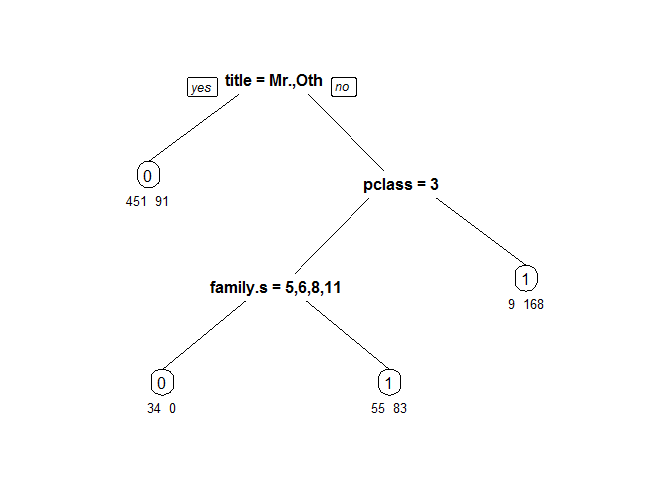<!-- -->

```r
# The plot bring out some interesting lines of investigation. Namely:
#      1 - Titles of "Mr." and "Other" are predicted to perish at an 
#          overall accuracy rate of 83.2 %.
#      2 - Titles of "Master.", "Miss.", & "Mrs." in 1st & 2nd class
#          are predicted to survive at an overall accuracy rate of 94.9%.
#      3 - Titles of "Master.", "Miss.", & "Mrs." in 3rd class with 
#          family sizes equal to 5, 6, 8, & 11 are predicted to perish
#          with 100% accuracy.
#      4 - Titles of "Master.", "Miss.", & "Mrs." in 3rd class with 
#          family sizes not equal to 5, 6, 8, or 11 are predicted to 
#          survive with 59.6% accuracy.


# Both rpart and rf confirm that title is important, let's investigate further
table(data.combined$title)
```

```
## 
## Master.   Miss.     Mr.    Mrs.   Other 
##      61     260     758     199      31
```

```r
# Parse out last name and title
data.combined[1:25, "name"]
```

```
##  [1] Braund, Mr. Owen Harris                                
##  [2] Cumings, Mrs. John Bradley (Florence Briggs Thayer)    
##  [3] Heikkinen, Miss. Laina                                 
##  [4] Futrelle, Mrs. Jacques Heath (Lily May Peel)           
##  [5] Allen, Mr. William Henry                               
##  [6] Moran, Mr. James                                       
##  [7] McCarthy, Mr. Timothy J                                
##  [8] Palsson, Master. Gosta Leonard                         
##  [9] Johnson, Mrs. Oscar W (Elisabeth Vilhelmina Berg)      
## [10] Nasser, Mrs. Nicholas (Adele Achem)                    
## [11] Sandstrom, Miss. Marguerite Rut                        
## [12] Bonnell, Miss. Elizabeth                               
## [13] Saundercock, Mr. William Henry                         
## [14] Andersson, Mr. Anders Johan                            
## [15] Vestrom, Miss. Hulda Amanda Adolfina                   
## [16] Hewlett, Mrs. (Mary D Kingcome)                        
## [17] Rice, Master. Eugene                                   
## [18] Williams, Mr. Charles Eugene                           
## [19] Vander Planke, Mrs. Julius (Emelia Maria Vandemoortele)
## [20] Masselmani, Mrs. Fatima                                
## [21] Fynney, Mr. Joseph J                                   
## [22] Beesley, Mr. Lawrence                                  
## [23] McGowan, Miss. Anna "Annie"                            
## [24] Sloper, Mr. William Thompson                           
## [25] Palsson, Miss. Torborg Danira                          
## 1307 Levels: Abbing, Mr. Anthony ... Zakarian, Mr. Ortin
```

```r
name.splits <- str_split(data.combined$name, ",")
name.splits[1]
```

```
## [[1]]
## [1] "Braund"           " Mr. Owen Harris"
```

```r
last.names <- sapply(name.splits, "[", 1)
last.names[1:10]
```

```
##  [1] "Braund"    "Cumings"   "Heikkinen" "Futrelle"  "Allen"    
##  [6] "Moran"     "McCarthy"  "Palsson"   "Johnson"   "Nasser"
```

```r
# Add last names to dataframe in case we find it useful later
data.combined$last.name <- last.names

# Now for titles
name.splits <- str_split(sapply(name.splits, "[", 2), " ")
titles <- sapply(name.splits, "[", 2)
unique(titles)
```

```
##  [1] "Mr."       "Mrs."      "Miss."     "Master."   "Don."     
##  [6] "Rev."      "Dr."       "Mme."      "Ms."       "Major."   
## [11] "Lady."     "Sir."      "Mlle."     "Col."      "Capt."    
## [16] "the"       "Jonkheer." "Dona."
```

```r
# What's up with a title of 'the'?
data.combined[which(titles == "the"),]
```

```
##     survived pclass
## 760        1      1
##                                                         name    sex age
## 760 Rothes, the Countess. of (Lucy Noel Martha Dyer-Edwards) female  33
##     sibsp parch ticket fare cabin embarked title family.size
## 760     0     0 110152 86.5   B77        S Other           1
##     ticket.first.char cabin.first.char cabin.multiple last.name
## 760                 1                B              N    Rothes
```

```r
# Re-map titles to be more exact
titles[titles %in% c("Dona.", "the")] <- "Lady."
titles[titles %in% c("Ms.", "Mlle.")] <- "Miss."
titles[titles == "Mme."] <- "Mrs."
titles[titles %in% c("Jonkheer.", "Don.")] <- "Sir."
titles[titles %in% c("Col.", "Capt.", "Major.")] <- "Officer"
table(titles)
```

```
## titles
##     Dr.   Lady. Master.   Miss.     Mr.    Mrs. Officer    Rev.    Sir. 
##       8       3      61     264     757     198       7       8       3
```

```r
# Make title a factor
data.combined$new.title <- as.factor(titles)

# Visualize new version of title
ggplot(data.combined[1:891,], aes(x = new.title, fill = survived)) +
  geom_bar() +
  facet_wrap(~ pclass) + 
  ggtitle("Surival Rates for new.title by pclass")
```

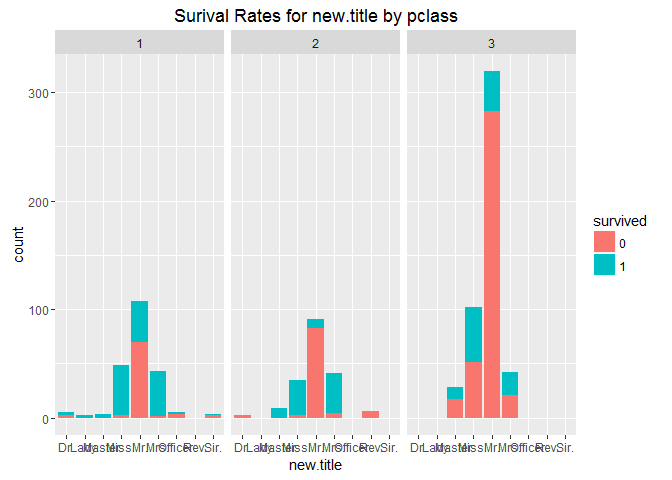<!-- -->

```r
# Collapse titles based on visual analysis
indexes <- which(data.combined$new.title == "Lady.")
data.combined$new.title[indexes] <- "Mrs."

indexes <- which(data.combined$new.title == "Dr." | 
                 data.combined$new.title == "Rev." |
                 data.combined$new.title == "Sir." |
                 data.combined$new.title == "Officer")
data.combined$new.title[indexes] <- "Mr."

# Visualize 
ggplot(data.combined[1:891,], aes(x = new.title, fill = survived)) +
  geom_bar() +
  facet_wrap(~ pclass) +
  ggtitle("Surival Rates for Collapsed new.title by pclass")
```

<!-- -->

```r
# Grab features
features <- c("pclass", "new.title", "family.size")
rpart.train.2 <- data.combined[1:891, features]

# Run CV and check out results
rpart.2.cv.1 <- rpart.cv(94622, rpart.train.2, rf.label, ctrl.3)
rpart.2.cv.1
```

```
## CART 
## 
## 891 samples
##   3 predictor
##   2 classes: '0', '1' 
## 
## No pre-processing
## Resampling: Cross-Validated (3 fold, repeated 10 times) 
## Summary of sample sizes: 594, 594, 594, 594, 594, 594, ... 
## Resampling results across tuning parameters:
## 
##   cp          Accuracy   Kappa    
##   0.00000000  0.8178451  0.6047735
##   0.01582980  0.8261504  0.6252869
##   0.03165961  0.8280584  0.6303902
##   0.04748941  0.8145903  0.6049449
##   0.06331922  0.7936027  0.5633852
##   0.07914902  0.7947250  0.5672045
##   0.09497883  0.7939394  0.5658414
##   0.11080863  0.7929293  0.5641059
##   0.12663844  0.7924804  0.5634784
##   0.14246824  0.7923681  0.5635873
##   0.15829804  0.7923681  0.5635873
##   0.17412785  0.7923681  0.5635873
##   0.18995765  0.7923681  0.5635873
##   0.20578746  0.7923681  0.5635873
##   0.22161726  0.7923681  0.5635873
##   0.23744707  0.7923681  0.5635873
##   0.25327687  0.7923681  0.5635873
##   0.26910667  0.7923681  0.5635873
##   0.28493648  0.7923681  0.5635873
##   0.30076628  0.7923681  0.5635873
##   0.31659609  0.7923681  0.5635873
##   0.33242589  0.7923681  0.5635873
##   0.34825570  0.7923681  0.5635873
##   0.36408550  0.7923681  0.5635873
##   0.37991531  0.7923681  0.5635873
##   0.39574511  0.7923681  0.5635873
##   0.41157491  0.7923681  0.5635873
##   0.42740472  0.7719416  0.5013069
##   0.44323452  0.7271605  0.3617107
##   0.45906433  0.7025814  0.2840360
## 
## Accuracy was used to select the optimal model using  the largest value.
## The final value used for the model was cp = 0.03165961.
```

```r
# Plot
prp(rpart.2.cv.1$finalModel, type = 0, extra = 1, under = TRUE)
```

<!-- -->

```r
# Dive in on 1st class Mr."
indexes.first.mr <- which(data.combined$new.title == "Mr." & data.combined$pclass == "1")
first.mr.df <- data.combined[indexes.first.mr, ]
summary(first.mr.df)
```

```
##  survived  pclass                                    name         sex     
##  0   :77   1:175   Anderson, Mr. Harry                 :  1   female:  1  
##  1   :43   2:  0   Andrews, Mr. Thomas Jr              :  1   male  :174  
##  None:55   3:  0   Artagaveytia, Mr. Ramon             :  1               
##                    Barkworth, Mr. Algernon Henry Wilson:  1               
##                    Baumann, Mr. John D                 :  1               
##                    Baxter, Mr. Quigg Edmond            :  1               
##                    (Other)                             :169               
##       age        sibsp       parch        ticket               fare       
##  Min.   :17.00   0:122   0      :146   Length:175         Min.   :  0.00  
##  1st Qu.:31.00   1: 50   1      : 21   Class :character   1st Qu.: 27.72  
##  Median :42.00   2:  2   2      :  6   Mode  :character   Median : 45.50  
##  Mean   :42.24   3:  1   3      :  1                      Mean   : 67.35  
##  3rd Qu.:50.50   4:  0   4      :  1                      3rd Qu.: 78.07  
##  Max.   :80.00   5:  0   5      :  0                      Max.   :512.33  
##  NA's   :28      8:  0   (Other):  0                                      
##     cabin           embarked     title      family.size  ticket.first.char
##  Length:175          :  0    Master.:  0   1      :109   1      :110      
##  Class :character   C: 68    Miss.  :  0   2      : 45   P      : 45      
##  Mode  :character   Q:  1    Mr.    :160   3      : 16   3      :  8      
##                     S:106    Mrs.   :  0   4      :  2   6      :  4      
##                              Other  : 15   6      :  2   2      :  3      
##                                            5      :  1   F      :  2      
##                                            (Other):  0   (Other):  3      
##  cabin.first.char cabin.multiple  last.name           new.title  
##  C      :47       N:162          Length:175         Mr.    :175  
##  U      :44       Y: 13          Class :character   Dr.    :  0  
##  B      :27                      Mode  :character   Lady.  :  0  
##  D      :20                                         Master.:  0  
##  E      :19                                         Miss.  :  0  
##  A      :17                                         Mrs.   :  0  
##  (Other): 1                                         (Other):  0
```

```r
# One female?
first.mr.df[first.mr.df$sex == "female",]
```

```
##     survived pclass                        name    sex age sibsp parch
## 797        1      1 Leader, Dr. Alice (Farnham) female  49     0     0
##     ticket    fare cabin embarked title family.size ticket.first.char
## 797  17465 25.9292   D17        S Other           1                 1
##     cabin.first.char cabin.multiple last.name new.title
## 797                D              N    Leader       Mr.
```

```r
# Update new.title feature
indexes <- which(data.combined$new.title == "Mr." & 
                 data.combined$sex == "female")
data.combined$new.title[indexes] <- "Mrs."

# Any other gender slip ups?
length(which(data.combined$sex == "female" & 
             (data.combined$new.title == "Master." |
              data.combined$new.title == "Mr.")))
```

```
## [1] 0
```

```r
# Refresh data frame
indexes.first.mr <- which(data.combined$new.title == "Mr." & data.combined$pclass == "1")
first.mr.df <- data.combined[indexes.first.mr, ]

# Let's look at surviving 1st class "Mr."
summary(first.mr.df[first.mr.df$survived == "1",])
```

```
##  survived  pclass                                        name   
##  0   : 0   1:42   Anderson, Mr. Harry                      : 1  
##  1   :42   2: 0   Barkworth, Mr. Algernon Henry Wilson     : 1  
##  None: 0   3: 0   Beckwith, Mr. Richard Leonard            : 1  
##                   Behr, Mr. Karl Howell                    : 1  
##                   Bishop, Mr. Dickinson H                  : 1  
##                   Bjornstrom-Steffansson, Mr. Mauritz Hakan: 1  
##                   (Other)                                  :36  
##      sex          age        sibsp      parch       ticket         
##  female: 0   Min.   :17.00   0:28   0      :36   Length:42         
##  male  :42   1st Qu.:28.00   1:13   1      : 4   Class :character  
##              Median :36.00   2: 1   2      : 2   Mode  :character  
##              Mean   :38.76   3: 0   3      : 0                     
##              3rd Qu.:48.00   4: 0   4      : 0                     
##              Max.   :80.00   5: 0   5      : 0                     
##              NA's   :5       8: 0   (Other): 0                     
##       fare           cabin           embarked     title     family.size
##  Min.   : 26.29   Length:42           : 0     Master.: 0   1      :25  
##  1st Qu.: 27.34   Class :character   C:17     Miss.  : 0   2      :12  
##  Median : 35.50   Mode  :character   Q: 0     Mr.    :38   3      : 4  
##  Mean   : 71.55                      S:25     Mrs.   : 0   4      : 1  
##  3rd Qu.: 73.39                               Other  : 4   5      : 0  
##  Max.   :512.33                                            6      : 0  
##                                                            (Other): 0  
##  ticket.first.char cabin.first.char cabin.multiple  last.name        
##  1      :30        C      :10       N:39           Length:42         
##  P      :11        E      : 8       Y: 3           Class :character  
##  2      : 1        B      : 7                      Mode  :character  
##  3      : 0        D      : 6                                        
##  4      : 0        U      : 6                                        
##  5      : 0        A      : 5                                        
##  (Other): 0        (Other): 0                                        
##    new.title 
##  Mr.    :42  
##  Dr.    : 0  
##  Lady.  : 0  
##  Master.: 0  
##  Miss.  : 0  
##  Mrs.   : 0  
##  (Other): 0
```

```r
View(first.mr.df[first.mr.df$survived == "1",])

# Take a look at some of the high fares
indexes <- which(data.combined$ticket == "PC 17755" |
                 data.combined$ticket == "PC 17611" |
                 data.combined$ticket == "113760")
View(data.combined[indexes,])

# Visualize survival rates for 1st class "Mr." by fare
ggplot(first.mr.df, aes(x = fare, fill = survived)) +
  geom_density(alpha = 0.5) +
  ggtitle("1st Class 'Mr.' Survival Rates by fare")
```

<!-- -->

```r
# Engineer features based on all the passengers with the same ticket
ticket.party.size <- rep(0, nrow(data.combined))
avg.fare <- rep(0.0, nrow(data.combined))
tickets <- unique(data.combined$ticket)

for (i in 1:length(tickets)) {
  current.ticket <- tickets[i]
  party.indexes <- which(data.combined$ticket == current.ticket)
  current.avg.fare <- data.combined[party.indexes[1], "fare"] / length(party.indexes)
  
  for (k in 1:length(party.indexes)) {
    ticket.party.size[party.indexes[k]] <- length(party.indexes)
    avg.fare[party.indexes[k]] <- current.avg.fare
  }
}

data.combined$ticket.party.size <- ticket.party.size
data.combined$avg.fare <- avg.fare

# Refresh 1st class "Mr." dataframe
first.mr.df <- data.combined[indexes.first.mr, ]
summary(first.mr.df)
```

```
##  survived  pclass                                    name         sex     
##  0   :77   1:174   Anderson, Mr. Harry                 :  1   female:  0  
##  1   :42   2:  0   Andrews, Mr. Thomas Jr              :  1   male  :174  
##  None:55   3:  0   Artagaveytia, Mr. Ramon             :  1               
##                    Barkworth, Mr. Algernon Henry Wilson:  1               
##                    Baumann, Mr. John D                 :  1               
##                    Baxter, Mr. Quigg Edmond            :  1               
##                    (Other)                             :168               
##       age        sibsp       parch        ticket               fare       
##  Min.   :17.00   0:121   0      :145   Length:174         Min.   :  0.00  
##  1st Qu.:31.00   1: 50   1      : 21   Class :character   1st Qu.: 27.72  
##  Median :42.00   2:  2   2      :  6   Mode  :character   Median : 46.30  
##  Mean   :42.20   3:  1   3      :  1                      Mean   : 67.58  
##  3rd Qu.:50.75   4:  0   4      :  1                      3rd Qu.: 78.46  
##  Max.   :80.00   5:  0   5      :  0                      Max.   :512.33  
##  NA's   :28      8:  0   (Other):  0                                      
##     cabin           embarked     title      family.size  ticket.first.char
##  Length:174          :  0    Master.:  0   1      :108   1      :109      
##  Class :character   C: 68    Miss.  :  0   2      : 45   P      : 45      
##  Mode  :character   Q:  1    Mr.    :160   3      : 16   3      :  8      
##                     S:105    Mrs.   :  0   4      :  2   6      :  4      
##                              Other  : 14   6      :  2   2      :  3      
##                                            5      :  1   F      :  2      
##                                            (Other):  0   (Other):  3      
##  cabin.first.char cabin.multiple  last.name           new.title  
##  C      :47       N:161          Length:174         Mr.    :174  
##  U      :44       Y: 13          Class :character   Dr.    :  0  
##  B      :27                      Mode  :character   Lady.  :  0  
##  D      :19                                         Master.:  0  
##  E      :19                                         Miss.  :  0  
##  A      :17                                         Mrs.   :  0  
##  (Other): 1                                         (Other):  0  
##  ticket.party.size    avg.fare     
##  Min.   :1.000     Min.   :  0.00  
##  1st Qu.:1.000     1st Qu.: 26.43  
##  Median :1.500     Median : 29.29  
##  Mean   :1.902     Mean   : 32.36  
##  3rd Qu.:2.000     3rd Qu.: 37.59  
##  Max.   :7.000     Max.   :128.08  
## 
```

```r
# Visualize new features
ggplot(first.mr.df[first.mr.df$survived != "None",], aes(x = ticket.party.size, fill = survived)) +
  geom_density(alpha = 0.5) +
  ggtitle("Survival Rates 1st Class 'Mr.' by ticket.party.size")
```

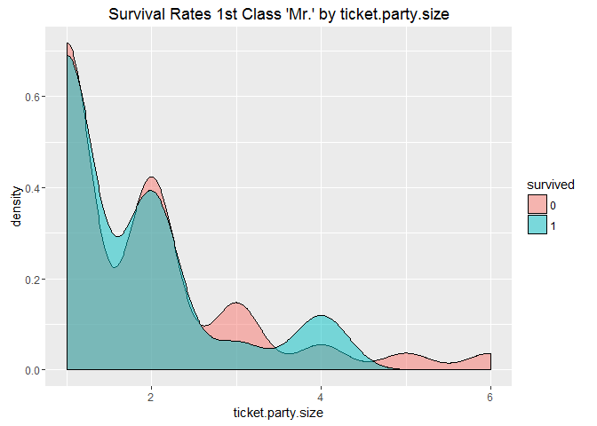<!-- -->

```r
ggplot(first.mr.df[first.mr.df$survived != "None",], aes(x = avg.fare, fill = survived)) +
  geom_density(alpha = 0.5) +
  ggtitle("Survival Rates 1st Class 'Mr.' by avg.fare")
```

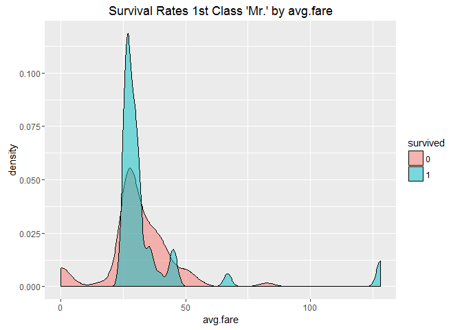<!-- -->

```r
# Hypothesis - ticket.party.size is highly correlated with avg.fare
summary(data.combined$avg.fare)
```

```
##    Min. 1st Qu.  Median    Mean 3rd Qu.    Max.    NA's 
##    0.00    7.55    8.05   14.76   15.01  128.10       1
```

```r
# One missing value, take a look
data.combined[is.na(data.combined$avg.fare), ]
```

```
##      survived pclass               name  sex  age sibsp parch ticket fare
## 1044     None      3 Storey, Mr. Thomas male 60.5     0     0   3701   NA
##      cabin embarked title family.size ticket.first.char cabin.first.char
## 1044     U        S   Mr.           1                 3                U
##      cabin.multiple last.name new.title ticket.party.size avg.fare
## 1044              N    Storey       Mr.                 1       NA
```

```r
# Get records for similar passengers and summarize avg.fares
indexes <- with(data.combined, which(pclass == "3" & title == "Mr." & family.size == 1 &
                                     ticket != "3701"))
similar.na.passengers <- data.combined[indexes,]
summary(similar.na.passengers$avg.fare)
```

```
##    Min. 1st Qu.  Median    Mean 3rd Qu.    Max. 
##   0.000   7.250   7.840   7.717   8.050  10.170
```

```r
# Use median since close to mean and a little higher than mean
data.combined[is.na(avg.fare), "avg.fare"] <- 7.840

# Leverage caret's preProcess function to normalize data
preproc.data.combined <- data.combined[, c("ticket.party.size", "avg.fare")]
preProc <- preProcess(preproc.data.combined, method = c("center", "scale"))

postproc.data.combined <- predict(preProc, preproc.data.combined)

# Hypothesis refuted for all data
cor(postproc.data.combined$ticket.party.size, postproc.data.combined$avg.fare)
```

```
## [1] 0.09428625
```

```r
# How about for just 1st class all-up?
indexes <- which(data.combined$pclass == "1")
cor(postproc.data.combined$ticket.party.size[indexes], 
    postproc.data.combined$avg.fare[indexes])
```

```
## [1] 0.2576249
```

```r
# Hypothesis refuted again


# OK, let's see if our feature engineering has made any difference
features <- c("pclass", "new.title", "family.size", "ticket.party.size", "avg.fare")
rpart.train.3 <- data.combined[1:891, features]

# Run CV and check out results
rpart.3.cv.1 <- rpart.cv(94622, rpart.train.3, rf.label, ctrl.3)
rpart.3.cv.1
```

```
## CART 
## 
## 891 samples
##   5 predictor
##   2 classes: '0', '1' 
## 
## No pre-processing
## Resampling: Cross-Validated (3 fold, repeated 10 times) 
## Summary of sample sizes: 594, 594, 594, 594, 594, 594, ... 
## Resampling results across tuning parameters:
## 
##   cp          Accuracy   Kappa    
##   0.00000000  0.8214366  0.6170703
##   0.01593063  0.8315376  0.6352241
##   0.03186126  0.8305275  0.6336075
##   0.04779189  0.8157127  0.6070448
##   0.06372252  0.7965208  0.5710962
##   0.07965316  0.7958474  0.5698216
##   0.09558379  0.7950617  0.5684585
##   0.11151442  0.7940516  0.5667230
##   0.12744505  0.7936027  0.5660955
##   0.14337568  0.7934905  0.5662044
##   0.15930631  0.7934905  0.5662044
##   0.17523694  0.7934905  0.5662044
##   0.19116757  0.7934905  0.5662044
##   0.20709821  0.7934905  0.5662044
##   0.22302884  0.7934905  0.5662044
##   0.23895947  0.7934905  0.5662044
##   0.25489010  0.7934905  0.5662044
##   0.27082073  0.7934905  0.5662044
##   0.28675136  0.7934905  0.5662044
##   0.30268199  0.7934905  0.5662044
##   0.31861262  0.7934905  0.5662044
##   0.33454325  0.7934905  0.5662044
##   0.35047389  0.7934905  0.5662044
##   0.36640452  0.7934905  0.5662044
##   0.38233515  0.7934905  0.5662044
##   0.39826578  0.7934905  0.5662044
##   0.41419641  0.7934905  0.5662044
##   0.43012704  0.7730640  0.5039239
##   0.44605767  0.7534231  0.4431483
##   0.46198830  0.6858586  0.2299565
## 
## Accuracy was used to select the optimal model using  the largest value.
## The final value used for the model was cp = 0.01593063.
```

```r
# Plot
prp(rpart.3.cv.1$finalModel, type = 0, extra = 1, under = TRUE)
```

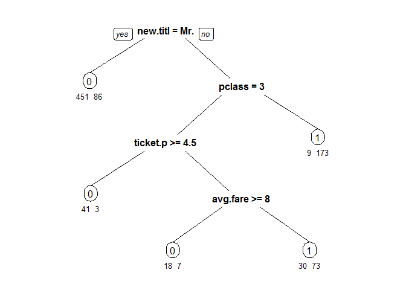<!-- -->

# Video7 Submitting, scoring, and some analysis
https://www.youtube.com/watch?v=fuB7s19g3nQ


```r
# Video7 Submitting, scoring, and some analysis ----

#
# Rpart scores 0.80383
#
# Subset our test records and features
test.submit.df <- data.combined[892:1309, features]

# Make predictions
rpart.3.preds <- predict(rpart.3.cv.1$finalModel, test.submit.df, type = "class")
table(rpart.3.preds)
```

```
## rpart.3.preds
##   0   1 
## 266 152
```

```r
# Write out a CSV file for submission to Kaggle
submit.df <- data.frame(PassengerId = rep(892:1309), Survived = rpart.3.preds)

write.csv(submit.df, file = "RPART_SUB_20160619_1.csv", row.names = FALSE)


#
# Random forest scores 0.80861
#
features <- c("pclass", "new.title", "ticket.party.size", "avg.fare")
rf.train.temp <- data.combined[1:891, features]

set.seed(1234)
rf.temp <- randomForest(x = rf.train.temp, y = rf.label, ntree = 1000)
rf.temp
```

```
## 
## Call:
##  randomForest(x = rf.train.temp, y = rf.label, ntree = 1000) 
##                Type of random forest: classification
##                      Number of trees: 1000
## No. of variables tried at each split: 2
## 
##         OOB estimate of  error rate: 16.16%
## Confusion matrix:
##     0   1 class.error
## 0 502  47   0.0856102
## 1  97 245   0.2836257
```

```r
test.submit.df <- data.combined[892:1309, features]

# Make predictions
rf.preds <- predict(rf.temp, test.submit.df)
table(rf.preds)
```

```
## rf.preds
##   0   1 
## 265 153
```

```r
# Write out a CSV file for submission to Kaggle
submit.df <- data.frame(PassengerId = rep(892:1309), Survived = rf.preds)

write.csv(submit.df, file = "RF_SUB_20160619_1.csv", row.names = FALSE)


#
# If we want to improve our model, a good place to start is focusing on where it
# gets things wrong!
#


# First, let's explore our collection of features using mutual information to
# gain some additional insight. Our intuition is that the plot of our tree
# should align well to the definition of mutual information.
#install.packages("infotheo")
library(infotheo)
```

```
## Warning: package 'infotheo' was built under R version 3.3.2
```

```r
mutinformation(rf.label, data.combined$pclass[1:891])
```

```
## [1] 0.05810725
```

```r
mutinformation(rf.label, data.combined$sex[1:891])
```

```
## [1] 0.1508705
```

```r
mutinformation(rf.label, data.combined$sibsp[1:891])
```

```
## [1] 0.02319709
```

```r
mutinformation(rf.label, data.combined$parch[1:891])
```

```
## [1] 0.01636558
```

```r
mutinformation(rf.label, discretize(data.combined$fare[1:891]))
```

```
## [1] 0.06616096
```

```r
mutinformation(rf.label, data.combined$embarked[1:891])
```

```
## [1] 0.01666817
```

```r
mutinformation(rf.label, data.combined$title[1:891])
```

```
## [1] 0.1661094
```

```r
mutinformation(rf.label, data.combined$family.size[1:891])
```

```
## [1] 0.04778124
```

```r
mutinformation(rf.label, data.combined$ticket.first.char[1:891])
```

```
## [1] 0.0686185
```

```r
mutinformation(rf.label, data.combined$cabin.multiple[1:891])
```

```
## [1] 0.002248365
```

```r
mutinformation(rf.label, data.combined$new.title[1:891])
```

```
## [1] 0.1710514
```

```r
mutinformation(rf.label, data.combined$ticket.party.size[1:891])
```

```
## [1] 0.05860494
```

```r
mutinformation(rf.label, discretize(data.combined$avg.fare[1:891]))
```

```
## [1] 0.05206484
```

```r
# OK, now let's leverage the tsne algorithm to create a 2-D representation of our data 
# suitable for visualization starting with folks our model gets right very often - folks
# with titles other than 'Mr."
#install.packages("Rtsne")
library(Rtsne)
```

```
## Warning: package 'Rtsne' was built under R version 3.3.2
```

```r
most.correct <- data.combined[data.combined$new.title != "Mr.",]
indexes <- which(most.correct$survived != "None")


# NOTE - Bug fix for original version. Rtsne needs a seed to ensure consistent
# output between runs.
set.seed(984357)
tsne.1 <- Rtsne(most.correct[, features], check_duplicates = FALSE)
ggplot(NULL, aes(x = tsne.1$Y[indexes, 1], y = tsne.1$Y[indexes, 2], 
                 color = most.correct$survived[indexes])) +
  geom_point() +
  labs(color = "Survived") +
  ggtitle("tsne 2D Visualization of Features for new.title Other than 'Mr.'")
```

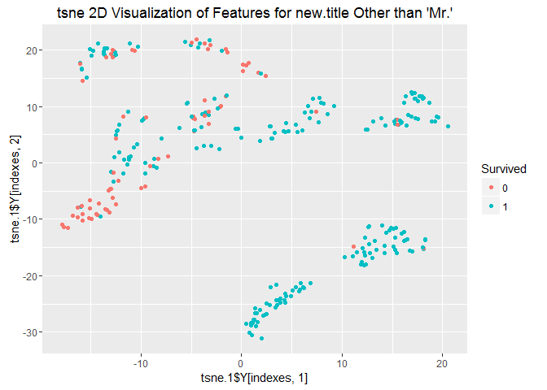<!-- -->

```r
# To get a baseline, let's use conditional mutual information on the tsne X and
# Y features for females and boys in 1st and 2nd class. The intuition here is that
# the combination of these features should be higher than any individual feature
# we looked at above.
condinformation(most.correct$survived[indexes], discretize(tsne.1$Y[indexes,]))
```

```
## [1] 0.2579789
```

```r
# As one more comparison, we can leverage conditional mutual information using
# the top two features used in our tree plot - new.title and pclass
condinformation(rf.label, data.combined[1:891, c("new.title", "pclass")])
```

```
## [1] 0.2506932
```

```r
# OK, now let's take a look at adult males since our model has the biggest 
# potential upside for improving (i.e., the tree predicts incorrectly for 86
# adult males). Let's visualize with tsne.
misters <- data.combined[data.combined$new.title == "Mr.",]
indexes <- which(misters$survived != "None")

tsne.2 <- Rtsne(misters[, features], check_duplicates = FALSE)
ggplot(NULL, aes(x = tsne.2$Y[indexes, 1], y = tsne.2$Y[indexes, 2], 
                 color = misters$survived[indexes])) +
  geom_point() +
  labs(color = "Survived") +
  ggtitle("tsne 2D Visualization of Features for new.title of 'Mr.'")
```

<!-- -->

```r
# Now conditional mutual information for tsne features for adult males
condinformation(misters$survived[indexes], discretize(tsne.2$Y[indexes,]))
```

```
## [1] 0.07556394
```

```r
#
# Idea - How about creating tsne featues for all of the training data and
# using them in our model?
#
tsne.3 <- Rtsne(data.combined[, features], check_duplicates = FALSE)
ggplot(NULL, aes(x = tsne.3$Y[1:891, 1], y = tsne.3$Y[1:891, 2], 
                 color = data.combined$survived[1:891])) +
  geom_point() +
  labs(color = "Survived") +
  ggtitle("tsne 2D Visualization of Features for all Training Data")
```

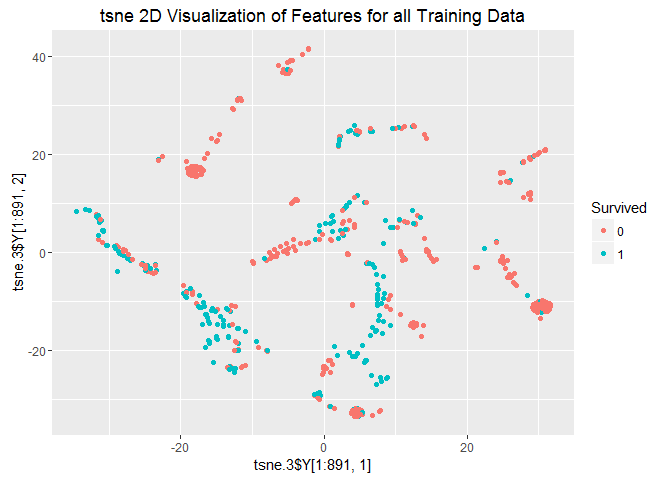<!-- -->

```r
# Now conditional mutual information for tsne features for all training
condinformation(data.combined$survived[1:891], discretize(tsne.3$Y[1:891,]))
```

```
## [1] 0.2135174
```

```r
# Add the tsne features to our data frame for use in model building
data.combined$tsne.x <- tsne.3$Y[,1]
data.combined$tsne.y <- tsne.3$Y[,2]
```


---
title: "TitanicDataAnalysis_Video7.R"
author: "takanori"
date: "Sat Nov 05 18:23:56 2016"
---
