# Ch10 - Data Manipulation and Related Topics


```r
library(lattice)
library(RColorBrewer)
```

Topics covered:

- Non-standard evaluation in the context of lattice
- The extended formula interface
- Combining data sources, subsetting
- Shingles
- Ordering levels of categorical variables
- Controlling the appearance of strips


```r
Titanic1 <- as.data.frame(as.table(Titanic[, , "Adult" ,])) 
Titanic1
```

```
##    Class    Sex Survived Freq
## 1    1st   Male       No  118
## 2    2nd   Male       No  154
## 3    3rd   Male       No  387
## 4   Crew   Male       No  670
## 5    1st Female       No    4
## 6    2nd Female       No   13
## 7    3rd Female       No   89
## 8   Crew Female       No    3
## 9    1st   Male      Yes   57
## 10   2nd   Male      Yes   14
## 11   3rd   Male      Yes   75
## 12  Crew   Male      Yes  192
## 13   1st Female      Yes  140
## 14   2nd Female      Yes   80
## 15   3rd Female      Yes   76
## 16  Crew Female      Yes   20
```

## Figure 10.1


```r
barchart(Class ~ Freq | Sex, Titanic1, 
         groups = Survived, stack = TRUE, 
         auto.key = list(title = "Survived", columns = 2))
```

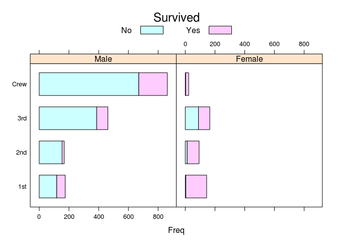<!-- -->

```r
Titanic2 <- 
  reshape(Titanic1, direction = "wide", v.names = "Freq", 
          idvar = c("Class", "Sex"), timevar = "Survived")
names(Titanic2) <- c("Class", "Sex", "Dead", "Alive")
Titanic2
```

```
##   Class    Sex Dead Alive
## 1   1st   Male  118    57
## 2   2nd   Male  154    14
## 3   3rd   Male  387    75
## 4  Crew   Male  670   192
## 5   1st Female    4   140
## 6   2nd Female   13    80
## 7   3rd Female   89    76
## 8  Crew Female    3    20
```

## Figure 10.2


```r
barchart(Class ~ Dead + Alive | Sex, 
         Titanic2, 
         stack = TRUE, 
         auto.key = list(columns = 2))
```

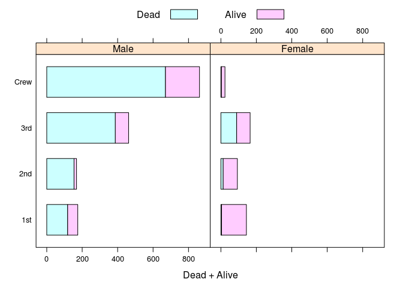<!-- -->

```r
data(Gcsemv, package = "mlmRev")
```

## Figure 10.3


```r
xyplot(written ~ course | gender, data = Gcsemv, 
       type = c("g", "p", "smooth"),
       xlab = "Coursework score", ylab = "Written exam score",
       panel = function(x, y, ...) {
         panel.xyplot(x, y, ...)
         panel.rug(x = x[is.na(y)], y = y[is.na(x)])
       })
```

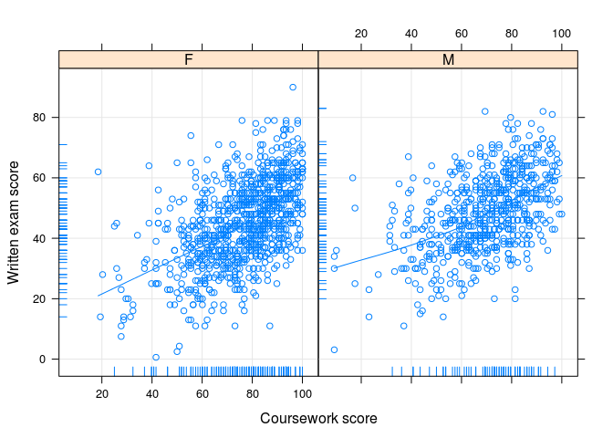<!-- -->

## Figure 10.4


```r
qqmath( ~ written + course, Gcsemv, type = c("p", "g"), 
        outer = TRUE, groups = gender, auto.key = list(columns = 2),
        f.value = ppoints(200), ylab = "Score")
```

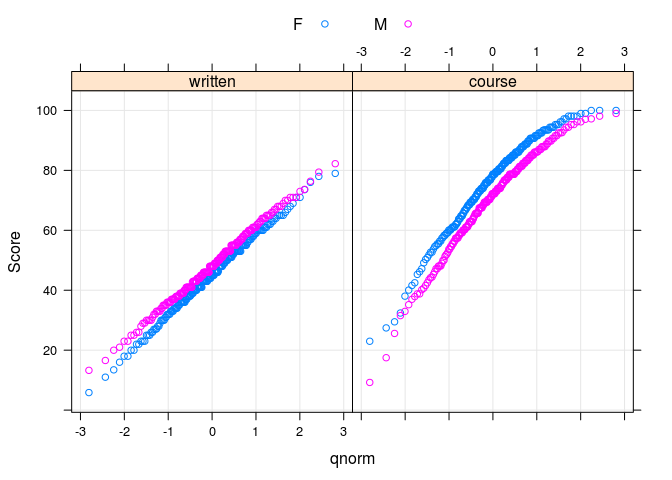<!-- -->

```r
set.seed(20051028)
x1 <- rexp(2000)
x1 <- x1[x1 > 1]
x2 <- rexp(1000)
str(make.groups(x1, x2))
```

```
## 'data.frame':	1772 obs. of  2 variables:
##  $ data : num  2.31 2.35 2.49 1.51 3.28 ...
##  $ which: Factor w/ 2 levels "x1","x2": 1 1 1 1 1 1 1 1 1 1 ...
```

## Figure 10.5


```r
qqmath(~ data, make.groups(x1, x2), groups = which, 
       distribution = qexp, aspect = "iso", type = c('p', 'g'))
```

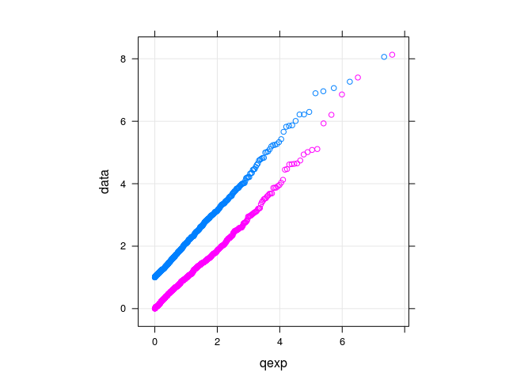<!-- -->

```r
str(beaver1)
```

```
## 'data.frame':	114 obs. of  4 variables:
##  $ day  : num  346 346 346 346 346 346 346 346 346 346 ...
##  $ time : num  840 850 900 910 920 930 940 950 1000 1010 ...
##  $ temp : num  36.3 36.3 36.4 36.4 36.5 ...
##  $ activ: num  0 0 0 0 0 0 0 0 0 0 ...
```

```r
str(beaver2)
```

```
## 'data.frame':	100 obs. of  4 variables:
##  $ day  : num  307 307 307 307 307 307 307 307 307 307 ...
##  $ time : num  930 940 950 1000 1010 1020 1030 1040 1050 1100 ...
##  $ temp : num  36.6 36.7 36.9 37.1 37.2 ...
##  $ activ: num  0 0 0 0 0 0 0 0 0 0 ...
```

```r
beavers <- make.groups(beaver1, beaver2)
str(beavers)
```

```
## 'data.frame':	214 obs. of  5 variables:
##  $ day  : num  346 346 346 346 346 346 346 346 346 346 ...
##  $ time : num  840 850 900 910 920 930 940 950 1000 1010 ...
##  $ temp : num  36.3 36.3 36.4 36.4 36.5 ...
##  $ activ: num  0 0 0 0 0 0 0 0 0 0 ...
##  $ which: Factor w/ 2 levels "beaver1","beaver2": 1 1 1 1 1 1 1 1 1 1 ...
```

```r
beavers$hour <- 
  with(beavers, time %/% 100 + 24*(day - 307) + (time %% 100)/60)
```

## Figure 10.6


```r
xyplot(temp ~ hour | which, data = beavers, groups = activ, 
       auto.key = list(text = c("inactive", "active"), columns = 2),
       xlab = "Time (hours)", ylab = "Body Temperature (C)", 
       scales = list(x = list(relation = "sliced")))
```

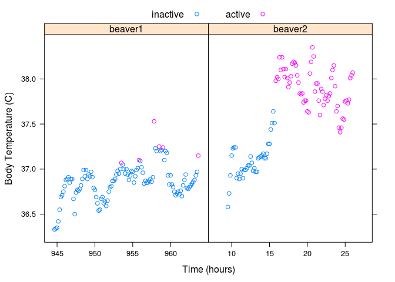<!-- -->

```r
data(USAge.df, package = "latticeExtra")
head(USAge.df)
```

```
##   Age  Sex Year Population
## 1   0 Male 1900      0.919
## 2   1 Male 1900      0.928
## 3   2 Male 1900      0.932
## 4   3 Male 1900      0.932
## 5   4 Male 1900      0.928
## 6   5 Male 1900      0.921
```

## Figure 10.7


```r
xyplot(Population ~ Age | factor(Year), USAge.df, 
       groups = Sex, type = c("l", "g"),
       auto.key = list(points = FALSE, lines = TRUE, columns = 2),
       aspect = "xy", ylab = "Population (millions)",
       subset = Year %in% seq(1905, 1975, by = 10))
```

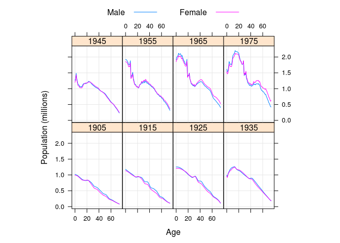<!-- -->

## Figure 10.8


```r
xyplot(Population ~ Year | factor(Age), USAge.df, 
       groups = Sex, type = "l", strip = FALSE, strip.left = TRUE, 
       layout = c(1, 3), ylab = "Population (millions)", 
       auto.key = list(lines = TRUE, points = FALSE, columns = 2),
       subset = Age %in% c(0, 10, 20))
```

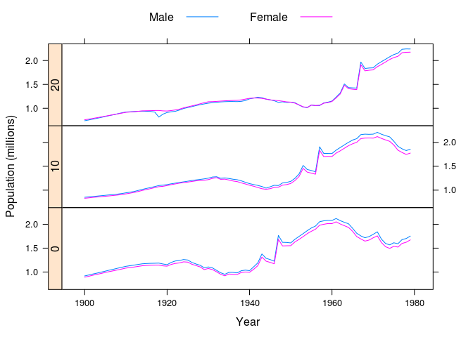<!-- -->

## Figure 10.9


```r
xyplot(Population ~ Year | factor(Year - Age), USAge.df, 
       groups = Sex, subset = (Year - Age) %in% 1894:1905,
       type = c("g", "l"), ylab = "Population (millions)", 
       auto.key = list(lines = TRUE, points = FALSE, columns = 2))
```

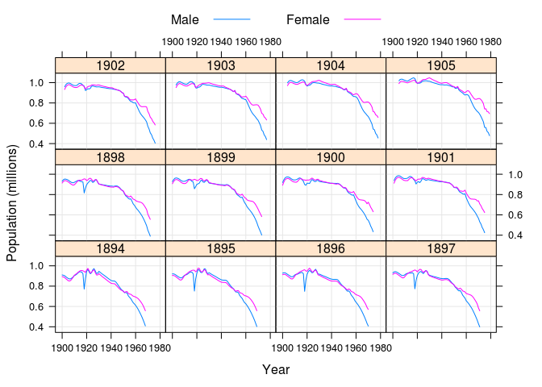<!-- -->

## Figure 10.10


```r
xyplot(stations ~ mag, quakes, jitter.x = TRUE, 
       type = c("p", "smooth"),
       xlab = "Magnitude (Richter)", 
       ylab = "Number of stations reporting") 
```

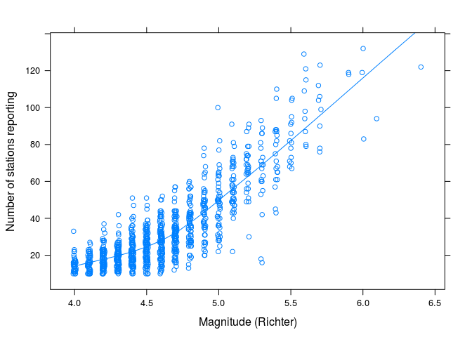<!-- -->

```r
quakes$Mag <- equal.count(quakes$mag, number = 10, overlap = 0.2)
summary(quakes$Mag)
```

```
## 
## Intervals:
##     min  max count
## 1  3.95 4.25   191
## 2  4.05 4.35   230
## 3  4.25 4.45   186
## 4  4.35 4.55   208
## 5  4.45 4.65   208
## 6  4.55 4.75   199
## 7  4.65 4.85   163
## 8  4.75 5.05   166
## 9  4.85 5.25   173
## 10 5.05 6.45   151
## 
## Overlap between adjacent intervals:
## [1] 145  85 101 107 101  98  65 101  72
```

```r
as.character(levels(quakes$Mag))
```

```
##  [1] "[ 3.95, 4.25 ]" "[ 4.05, 4.35 ]" "[ 4.25, 4.45 ]" "[ 4.35, 4.55 ]"
##  [5] "[ 4.45, 4.65 ]" "[ 4.55, 4.75 ]" "[ 4.65, 4.85 ]" "[ 4.75, 5.05 ]"
##  [9] "[ 4.85, 5.25 ]" "[ 5.05, 6.45 ]"
```

```r
ps.mag <- plot(quakes$Mag, ylab = "Level",
               xlab = "Magnitude (Richter)")
bwp.quakes <- 
  bwplot(stations ~ Mag, quakes, xlab = "Magnitude", 
         ylab = "Number of stations reporting")
```

## Figure 10.11


```r
plot(bwp.quakes, position = c(0, 0, 1, 0.65))
plot(ps.mag, position = c(0, 0.65, 1, 1), newpage = FALSE)
```

<!-- -->

## Figure 10.12


```r
bwplot(sqrt(stations) ~ Mag, quakes, 
       scales = 
         list(x = list(limits = as.character(levels(quakes$Mag)), 
                       rot = 60)),
       xlab = "Magnitude (Richter)",
       ylab = expression(sqrt("Number of stations")))
```

<!-- -->

## Figure 10.13


```r
qqmath(~ sqrt(stations) | Mag, quakes, 
       type = c("p", "g"), pch = ".", cex = 3, 
       prepanel = prepanel.qqmathline, aspect = "xy",
       strip = strip.custom(strip.levels = TRUE, 
                            strip.names = FALSE),
       xlab = "Standard normal quantiles", 
       ylab = expression(sqrt("Number of stations")))
```

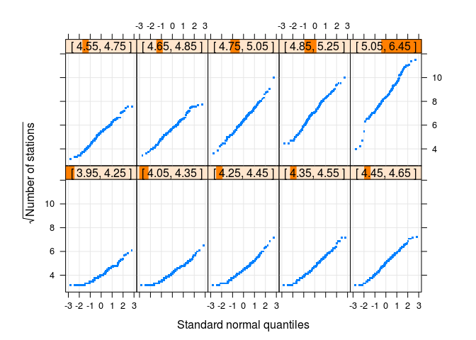<!-- -->

## Figure 10.14


```r
xyplot(sqrt(stations) ~ mag, quakes, cex = 0.6,
       panel = panel.bwplot, horizontal = FALSE, box.ratio = 0.05, 
       xlab = "Magnitude (Richter)", 
       ylab = expression(sqrt("Number of stations")))
```

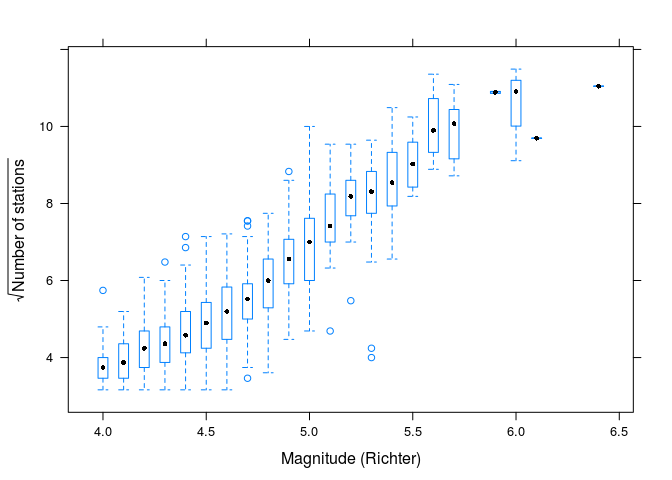<!-- -->

```r
state.density <-
  data.frame(name = state.name,
             area = state.x77[, "Area"],
             population = state.x77[, "Population"],
             region = state.region)
state.density$density <- with(state.density, population / area)
```

## Figure 10.15


```r
dotplot(reorder(name, density) ~ density, state.density,
        xlab = "Population Density (thousands per square mile)")
```

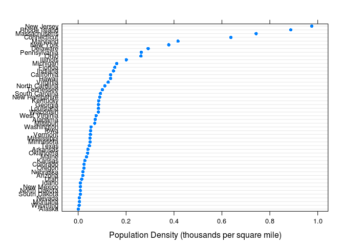<!-- -->

```r
state.density$Density <-
  shingle(state.density$density,
          intervals = rbind(c(0, 0.2),
                            c(0.2, 1)))
```

## Figure 10.16


```r
dotplot(reorder(name, density) ~ density | Density, state.density,
        strip = FALSE, layout = c(2, 1), levels.fos = 1:50,
        scales = list(x = "free"), between = list(x = 0.5),
        xlab = "Population Density (thousands per square mile)", 
        par.settings = list(layout.widths = list(panel = c(2, 1))))
```

<!-- -->

```r
cutAndStack <- 
  function(x, number = 6, overlap = 0.1, type = 'l',
           xlab = "Time", ylab = deparse(substitute(x)), ...) {
    time <- if (is.ts(x)) time(x) else seq_along(x)
    Time <- equal.count(as.numeric(time), 
                        number = number, overlap = overlap)
    xyplot(as.numeric(x) ~ time | Time,
           type = type, xlab = xlab, ylab = ylab,
           default.scales = list(x = list(relation = "free"),
                                 y = list(relation = "free")),
           ...)
  }
```

## Figure 10.17


```r
cutAndStack(EuStockMarkets[, "DAX"], aspect = "xy",
            scales = list(x = list(draw = FALSE), 
                          y = list(rot = 0)))
```

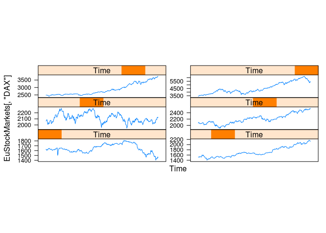<!-- -->

```r
bdp1 <- 
  dotplot(as.character(variety) ~ yield | as.character(site), barley,
          groups = year, layout = c(1, 6),
          auto.key = list(space = "top", columns = 2),
          #' ## strip = FALSE, strip.left = TRUE,
          aspect = "fill")
bdp2 <- 
  dotplot(variety ~ yield | site, barley,
          groups = year, layout = c(1, 6),
          auto.key = list(space = "top", columns = 2),
          #' ## strip = FALSE, strip.left = TRUE)
          aspect = "fill")
```

## Figure 10.18


```r
plot(bdp1, split = c(1, 1, 2, 1))
plot(bdp2, split = c(2, 1, 2, 1), newpage = FALSE)
```

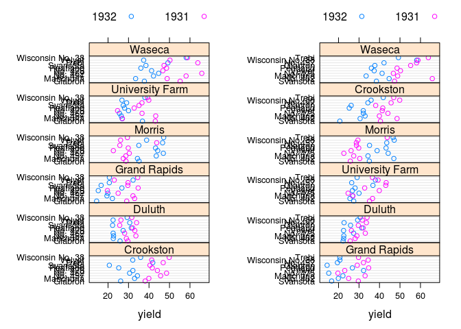<!-- -->

```r
state.density <-
  data.frame(name = state.name,
             area = state.x77[, "Area"],
             population = state.x77[, "Population"],
             region = state.region)
state.density$density <- with(state.density, population / area)
```

## Figure 10.19


```r
dotplot(reorder(name, density) ~ 1000 * density, state.density, 
        scales = list(x = list(log = 10)), 
        xlab = "Density (per square mile)")
```

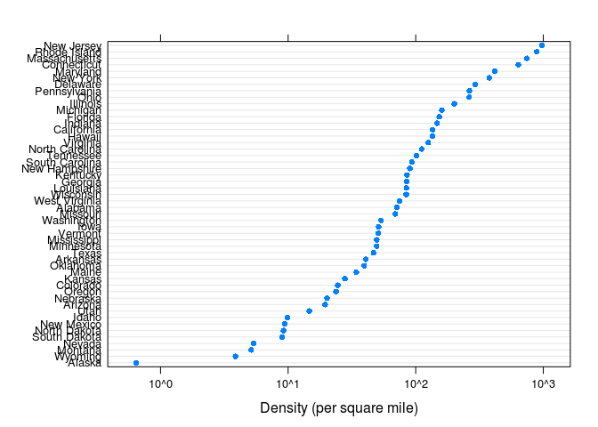<!-- -->

```r
state.density$region <- 
  with(state.density, reorder(region, density, median))
state.density$name <- 
  with(state.density, 
       reorder(reorder(name, density), as.numeric(region)))
```

## Figure 10.20


```r
# dotplot(name ~ 1000 * density | region, state.density,
#         strip = FALSE, strip.left = TRUE, layout = c(1, 4),
#         scales = list(x = list(log = 10),
#                       y = list(relation = "free")),
#         xlab = "Density (per square mile)")

library("latticeExtra")
```

## Figure 10.21


```r
resizePanels()
```

```
## Nothing to be done.
```

```
## NULL
```

```r
data(USCancerRates, package = "latticeExtra")
```

## Figure 10.22


```r
xyplot(rate.male ~ rate.female | state, USCancerRates,
       aspect = "iso", pch = ".", cex = 2,
       index.cond = function(x, y) { median(y - x, na.rm = TRUE) },
       scales = list(log = 2, at = c(75, 150, 300, 600)),
       panel = function(...) {
         panel.grid(h = -1, v = -1)
         panel.abline(0, 1)
         panel.xyplot(...)
       })
```

<!-- -->

```r
strip.style4 <- function(..., style) {
  strip.default(..., style = 4)
}
data(Chem97, package = "mlmRev")
```

## Figure 10.23


```r
qqmath(~gcsescore | factor(score), Chem97, groups = gender,
       type = c("l", "g"),  aspect = "xy",
       auto.key = list(points = FALSE, lines = TRUE, columns = 2),
       f.value = ppoints(100), strip = strip.style4,
       xlab = "Standard normal quantiles",
       ylab = "Average GCSE score")
```

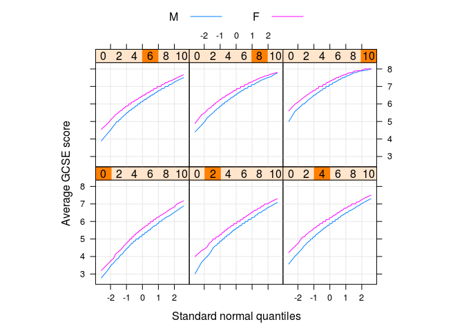<!-- -->

```r
strip.combined <-
  function(which.given, which.panel, factor.levels, ...) {
    if (which.given == 1) {
      panel.rect(0, 0, 1, 1, col = "grey90", border = 1)
      panel.text(x = 0, y = 0.5, pos = 4,
                 lab = factor.levels[which.panel[which.given]])
    }
    if (which.given == 2) {
      panel.text(x = 1, y = 0.5, pos = 2,
                 lab = factor.levels[which.panel[which.given]])
    }
  }
```

## Figure 10.24


```r
qqmath(~ gcsescore | factor(score) + gender, Chem97,
       f.value = ppoints(100), type = c("l", "g"), aspect = "xy",
       strip = strip.combined,
       par.strip.text = list(lines = 0.5),
       xlab = "Standard normal quantiles",
       ylab = "Average GCSE score")
```

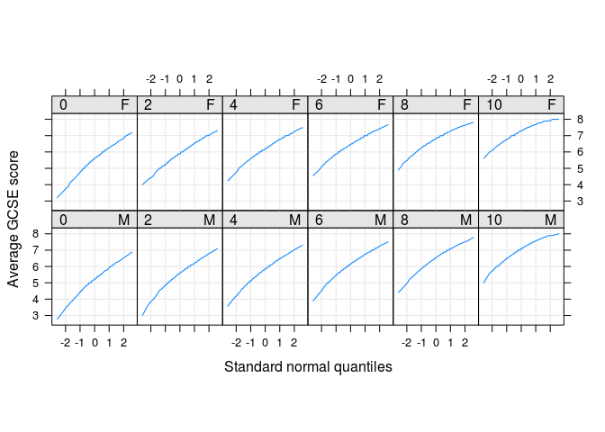<!-- -->

```r
morris <- barley$site == "Morris"
barley$year[morris] <-
  ifelse(barley$year[morris] == "1931", "1932", "1931")
```

## Figure 10.25


```r
stripplot(sqrt(abs(residuals(lm(yield ~ variety+year+site)))) ~ site,
          data = barley, groups = year, jitter.data = TRUE,
          auto.key = list(points = TRUE, lines = TRUE, columns = 2),
          type = c("p", "a"), fun = median,
          ylab = expression(abs("Residual Barley Yield")^{1 / 2}))
```

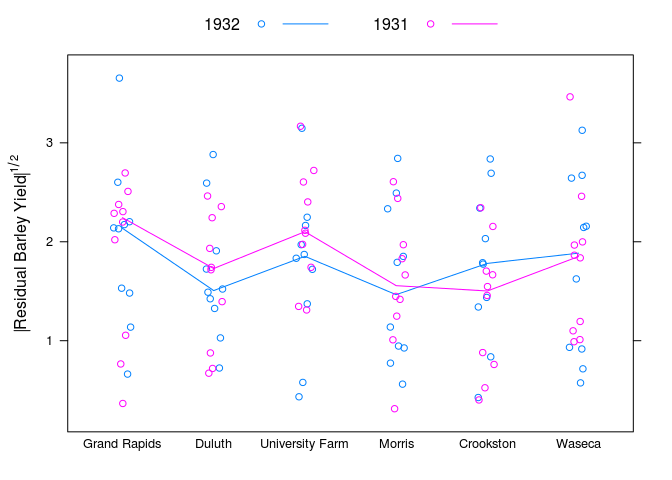<!-- -->


---
title: "ch10.R"
author: "takanori"
date: "Thu Nov  3 20:59:11 2016"
---
