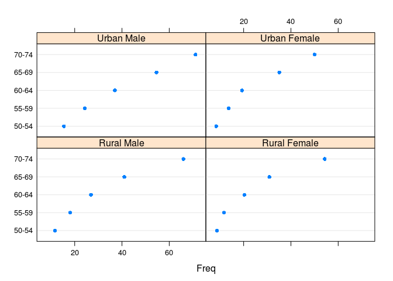
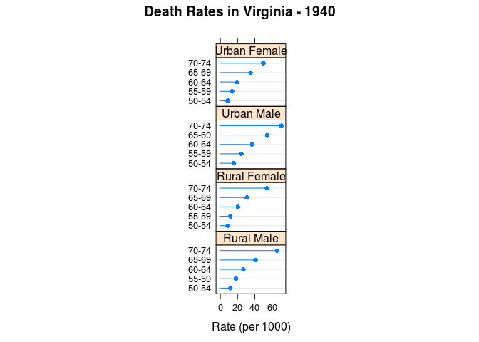
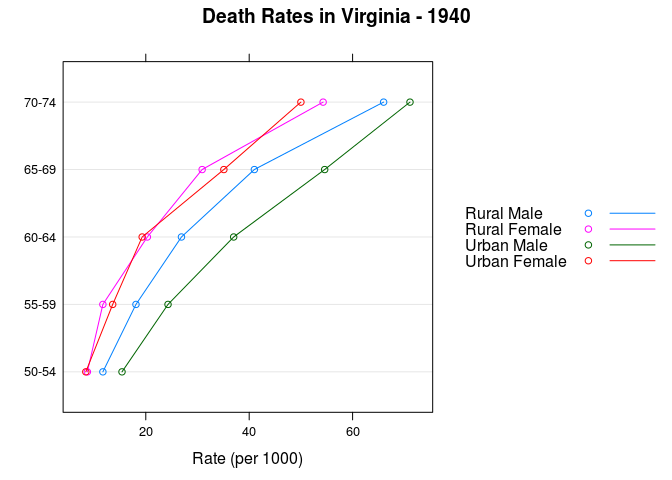
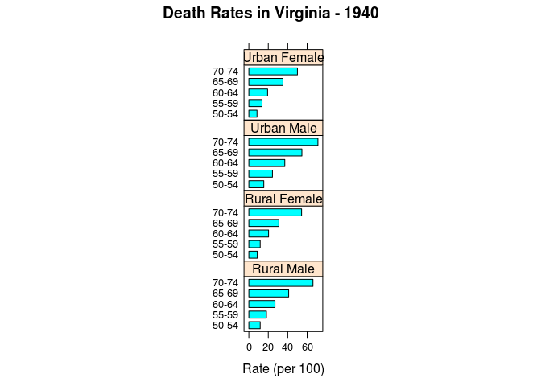
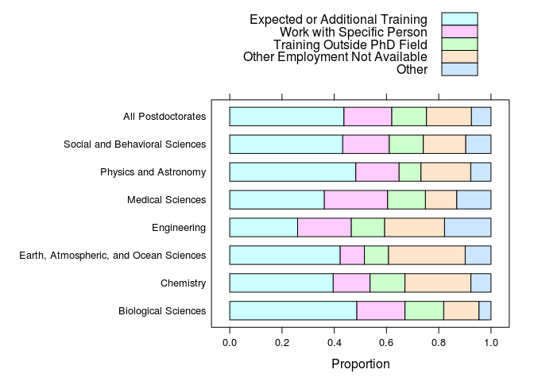
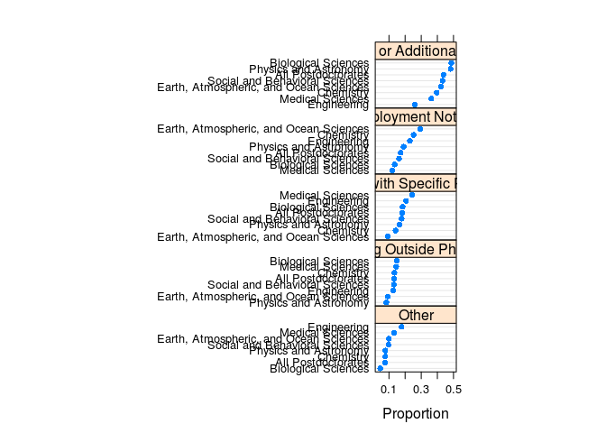
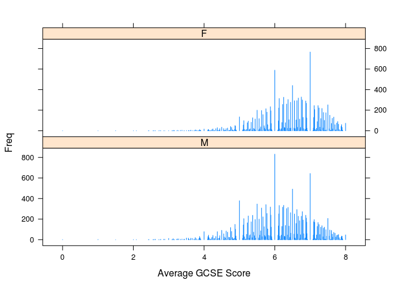

# Ch4 - Displaying Multiway Tables

**Topics covered**:

- Cleveland dot plot
- Bar chart
- Reordering factor levels


```r
library(lattice)

VADeaths
```

```
##       Rural Male Rural Female Urban Male Urban Female
## 50-54       11.7          8.7       15.4          8.4
## 55-59       18.1         11.7       24.3         13.6
## 60-64       26.9         20.3       37.0         19.3
## 65-69       41.0         30.9       54.6         35.1
## 70-74       66.0         54.3       71.1         50.0
```

```r
class(VADeaths)
```

```
## [1] "matrix"
```

```r
methods("dotplot")
```

```
## [1] dotplot.array*   dotplot.default* dotplot.formula* dotplot.matrix* 
## [5] dotplot.numeric* dotplot.table*  
## see '?methods' for accessing help and source code
```

## Figure 4.1


```r
dotplot(VADeaths, groups = FALSE)
```

<!-- -->

## Figure 4.2


```r
dotplot(VADeaths, groups = FALSE, 
        layout = c(1, 4), aspect = 0.7, 
        origin = 0, type = c("p", "h"),
        main = "Death Rates in Virginia - 1940", 
        xlab = "Rate (per 1000)")
```

<!-- -->

## Figure 4.3


```r
dotplot(VADeaths, type = "o",
        auto.key = list(lines = TRUE, space = "right"),
        main = "Death Rates in Virginia - 1940",
        xlab = "Rate (per 1000)")
```

<!-- -->

## Figure 4.4


```r
barchart(VADeaths, groups = FALSE,
         layout = c(1, 4), aspect = 0.7, reference = FALSE, 
         main = "Death Rates in Virginia - 1940",
         xlab = "Rate (per 100)")
```

<!-- -->

```r
data(postdoc, package = "latticeExtra")
```

## Figure 4.5


```r
barchart(prop.table(postdoc, margin = 1), xlab = "Proportion",
         auto.key = list(adj = 1))
```

<!-- -->

## Figure 4.6


```r
dotplot(prop.table(postdoc, margin = 1), groups = FALSE, 
        xlab = "Proportion",
        par.strip.text = list(abbreviate = TRUE, minlength = 10))
```

<!-- -->

## Figure 4.7


```r
dotplot(prop.table(postdoc, margin = 1), groups = FALSE, 
        index.cond = function(x, y) median(x),
        xlab = "Proportion", layout = c(1, 5), aspect = 0.6,
        scales = list(y = list(relation = "free", rot = 0)),
        prepanel = function(x, y) {
          list(ylim = levels(reorder(y, x)))
        },
        panel = function(x, y, ...) {
          panel.dotplot(x, reorder(y, x), ...)
        })
```

<!-- -->

```r
data(Chem97, package = "mlmRev")
gcsescore.tab <- xtabs(~gcsescore + gender, Chem97)
gcsescore.df <- as.data.frame(gcsescore.tab)
gcsescore.df$gcsescore <- 
  as.numeric(as.character(gcsescore.df$gcsescore))
```

## Figure 4.8


```r
xyplot(Freq ~ gcsescore | gender, data = gcsescore.df, 
       type = "h", layout = c(1, 2), xlab = "Average GCSE Score")
```

<!-- -->

```r
score.tab <- xtabs(~score + gender, Chem97)
score.df <- as.data.frame(score.tab)
```

## Figure 4.9


```r
barchart(Freq ~ score | gender, score.df, origin = 0)
```

<!-- -->


---
title: "ch4.R"
author: "takanori"
date: "Thu Nov  3 20:26:38 2016"
---
