# Ch5 - Scatter Plots and Extensions


```r
library(lattice)
library(grid)
```

Topics covered:

- The standard scatter plot
- Using subscripts
- Using the type argument
- Variants for large data
- Scatter plot matrix
- Parallel coordinate plot

## Figure 5.1


```r
xyplot(lat ~ long | cut(depth, 2), data = quakes)
```

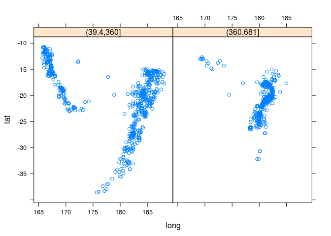<!-- -->

## Figure 5.2


```r
xyplot(lat ~ long | cut(depth, 3), data = quakes, 
       aspect = "iso", pch = ".", cex = 2, type = c("p", "g"),
       xlab = "Longitude", ylab = "Latitude", 
       strip = strip.custom(strip.names = TRUE, var.name = "Depth"))
```

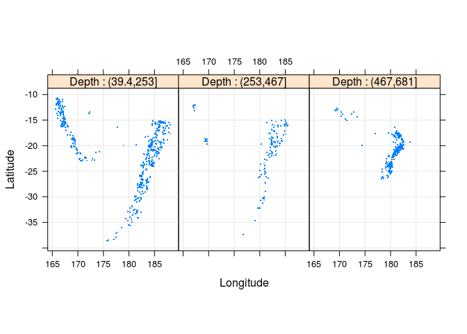<!-- -->

## Figure 5.3


```r
xyplot(lat ~ long, data = quakes, aspect = "iso",
       groups = cut(depth, breaks = quantile(depth, ppoints(4, 1))), 
       auto.key = list(columns = 3, title = "Depth"), 
       xlab = "Longitude", ylab = "Latitude")
```

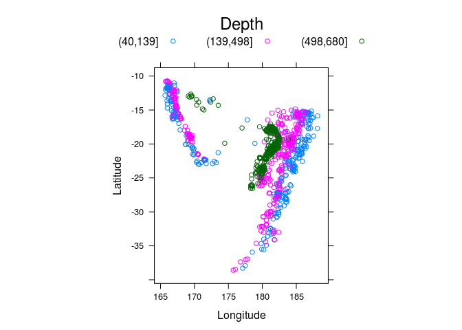<!-- -->

```r
depth.col <- gray.colors(100)[cut(quakes$depth, 100, label = FALSE)]
depth.ord <- rev(order(quakes$depth))
```

## Figure 5.4


```r
xyplot(lat ~ long, data = quakes[depth.ord, ], 
       aspect = "iso", type = c("p", "g"), col = "black",
       pch = 21, fill = depth.col[depth.ord], cex = 2,
       xlab = "Longitude", ylab = "Latitude")
```

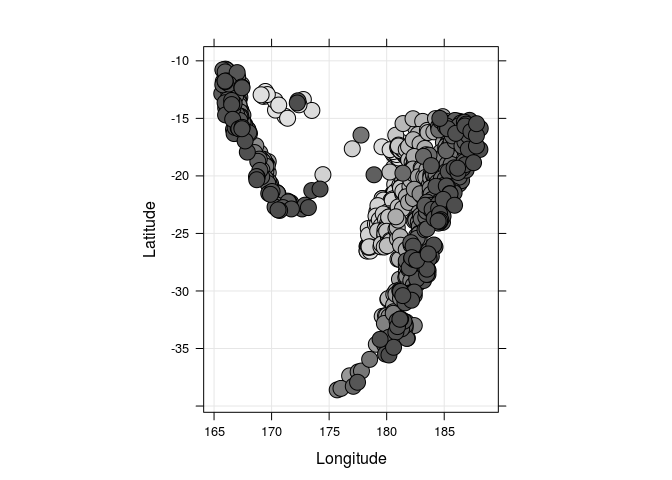<!-- -->

```r
quakes$Magnitude <- equal.count(quakes$mag, 4)
summary(quakes$Magnitude)
```

```
## 
## Intervals:
##    min  max count
## 1 3.95 4.55   484
## 2 4.25 4.75   492
## 3 4.45 4.95   425
## 4 4.65 6.45   415
## 
## Overlap between adjacent intervals:
## [1] 293 306 217
```

```r
quakes$color <- depth.col
quakes.ordered <- quakes[depth.ord, ]
```

## Figure 5.5


```r
xyplot(lat ~ long | Magnitude, data = quakes.ordered, col = "black",
       aspect = "iso", fill.color = quakes.ordered$color, cex = 2,
       panel = function(x, y, fill.color, ..., subscripts) {
         fill <- fill.color[subscripts]
         panel.grid(h = -1, v = -1)
         panel.xyplot(x, y, pch = 21, fill = fill, ...)
       },
       xlab = "Longitude", ylab = "Latitude")
```

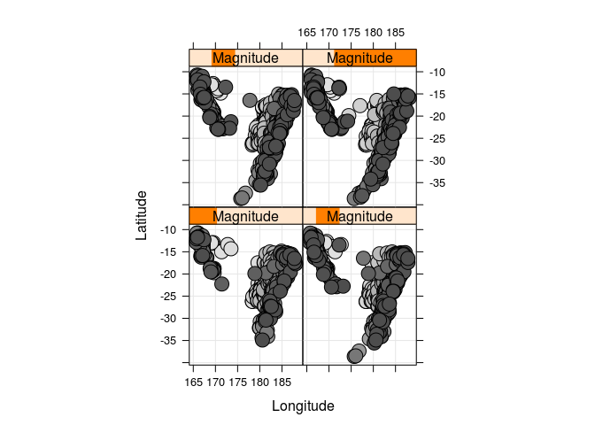<!-- -->

```r
depth.breaks <- do.breaks(range(quakes.ordered$depth), 50)
quakes.ordered$color <- 
  level.colors(quakes.ordered$depth, at = depth.breaks, 
               col.regions = gray.colors)
```

## Figure 5.6


```r
xyplot(lat ~ long | Magnitude, data = quakes.ordered, 
       aspect = "iso", groups = color, cex = 2, col = "black",
       panel = function(x, y, groups, ..., subscripts) {
         fill <- groups[subscripts]
         panel.grid(h = -1, v = -1)
         panel.xyplot(x, y, pch = 21, fill = fill, ...)
       },
       legend = 
         list(right = 
                list(fun = draw.colorkey,
                     args = list(key = list(col = gray.colors,
                                            at = depth.breaks), 
                                 draw = FALSE))),
       xlab = "Longitude", ylab = "Latitude")
```

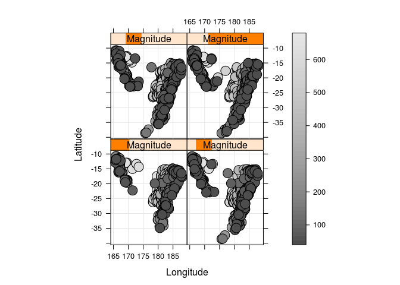<!-- -->

```r
types.plain <- c("p", "l", "o", "r", "g", "s", "S", "h", "a", "smooth")
types.horiz <- c("s", "S", "h", "a", "smooth")
horiz <- rep(c(FALSE, TRUE), c(length(types.plain), length(types.horiz)))
types <- c(types.plain, types.horiz)
set.seed(2007041)
x <- sample(seq(-10, 10, length = 15), 30, TRUE)
y <- x + 0.25 * (x + 1)^2 + rnorm(length(x), sd = 5)
```

## Figure 5.7


```r
xyplot(y ~ x | gl(1, length(types)),
       xlab = "type", 
       ylab = list(c("horizontal=TRUE", "horizontal=FALSE"), y = c(1/6, 4/6)),
       as.table = TRUE, layout = c(5, 3),
       between = list(y = c(0, 1)),
       strip = function(...) {
         panel.fill(trellis.par.get("strip.background")$col[1])
         type <- types[panel.number()]
         grid.text(lab = sprintf('"%s"', type), 
                   x = 0.5, y = 0.5)
         grid.rect()
       },
       scales = list(alternating = c(0, 2), tck = c(0, 0.7), draw = FALSE),
       par.settings = 
         list(layout.widths = list(strip.left = c(1, 0, 0, 0, 0))),
       panel = function(...) {
         type <- types[panel.number()]
         horizontal <- horiz[panel.number()]
         panel.xyplot(..., 
                      type = type,
                      horizontal = horizontal)
       })[rep(1, length(types))]
```

<!-- -->

```r
data(Earthquake, package = "MEMSS")
```

## Figure 5.8


```r
xyplot(accel ~ distance, data = Earthquake,
       panel = function(...) {
         panel.grid(h = -1, v = -1)
         panel.xyplot(...)
         panel.loess(...)
       }, 
       xlab = "Distance From Epicenter (km)",
       ylab = "Maximum Horizontal Acceleration (g)")
```

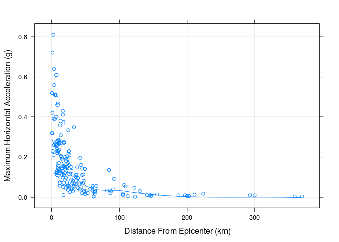<!-- -->

## Figure 5.9


```r
xyplot(accel ~ distance, data = Earthquake,
       type = c("g", "p", "smooth"),
       scales = list(log = 2),
       xlab = "Distance From Epicenter (km)",
       ylab = "Maximum Horizontal Acceleration (g)")
```

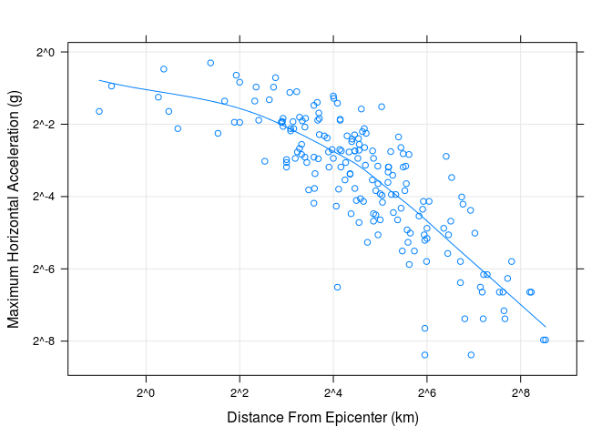<!-- -->

```r
library("locfit")
```

```
## locfit 1.5-9.1 	 2013-03-22
```

```r
Earthquake$Magnitude <- 
  equal.count(Earthquake$Richter, 3, overlap = 0.1)
coef <- coef(lm(log2(accel) ~ log2(distance), data = Earthquake))
```

## Figure 5.10


```r
xyplot(accel ~ distance | Magnitude, data = Earthquake,
       scales = list(log = 2), col.line = "grey", lwd = 2,
       panel = function(...) {
         panel.abline(reg = coef)
         panel.locfit(...)
       },
       xlab = "Distance From Epicenter (km)",
       ylab = "Maximum Horizontal Acceleration (g)")
```

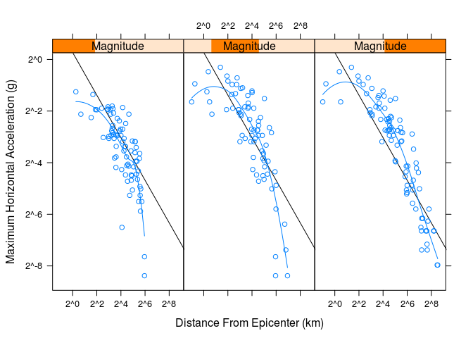<!-- -->

```r
data(SeatacWeather, package = "latticeExtra")
```

## Figure 5.11


```r
xyplot(min.temp + max.temp + precip ~ day | month,
       ylab = "Temperature and Rainfall", 
       data = SeatacWeather, type = "l", lty = 1, col = "black")
```

<!-- -->

```r
maxp <- max(SeatacWeather$precip, na.rm = TRUE)
```

## Figure 5.12


```r
xyplot(min.temp + max.temp + I(80 * precip / maxp) ~ day | month,
       data = SeatacWeather, lty = 1, col = "black",
       ylab = "Temperature and Rainfall", 
       type = c("l", "l", "h"), distribute.type = TRUE)
```

<!-- -->

## Figure 5.13


```r
update(trellis.last.object(),
       ylab = "Temperature (Fahrenheit) \n and Rainfall (inches)",
       panel = function(...) {
         panel.xyplot(...)
         if (panel.number() == 2) {
           at <- pretty(c(0, maxp))
           panel.axis("right", half = FALSE,
                      at = at * 80 / maxp, labels = at)
         }
       })
```

<!-- -->

```r
library("hexbin")
data(gvhd10, package = "latticeExtra")
```

## Figure 5.14


```r
xyplot(asinh(SSC.H) ~ asinh(FL2.H) | Days, gvhd10, aspect = 1, 
       panel = panel.hexbinplot, .aspect.ratio = 1, trans = sqrt)
```

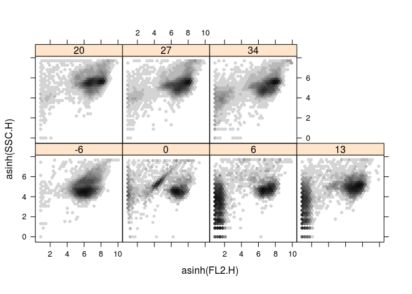<!-- -->

## Figure 5.15


```r
splom(USArrests)
```

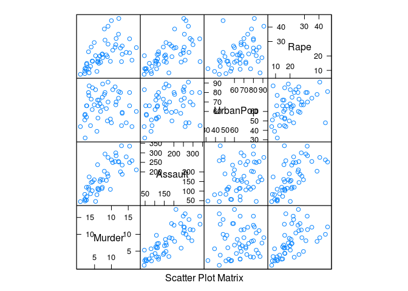<!-- -->

## Figure 5.16


```r
splom(~USArrests[c(3, 1, 2, 4)] | state.region, 
      pscales = 0, type = c("g", "p", "smooth"))
```

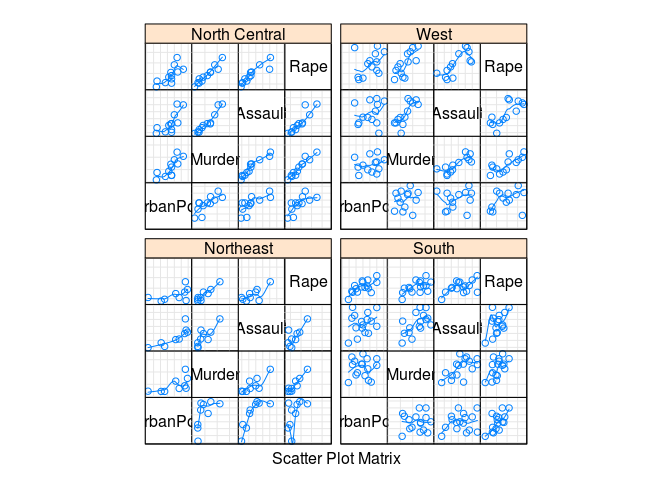<!-- -->

## Figure 5.17


```r
splom(~data.frame(mpg, disp, hp, drat, wt, qsec),
      data = mtcars, groups = cyl, pscales = 0, 
      varnames = c("Miles\nper\ngallon", "Displacement\n(cu. in.)",
                   "Gross\nhorsepower", "Rear\naxle\nratio", 
                   "Weight", "1/4 mile\ntime"),
      auto.key = list(columns = 3, title = "Number of Cylinders"))
```

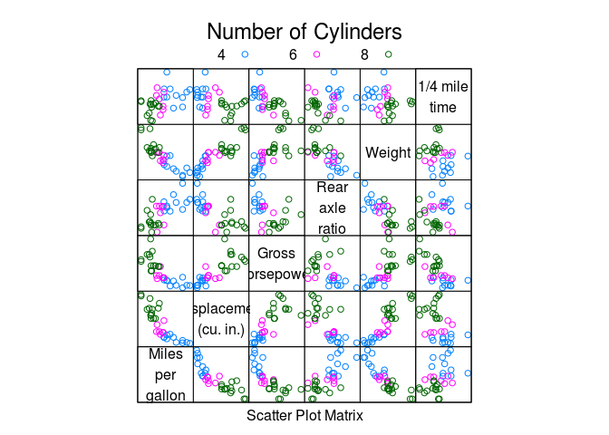<!-- -->

## Figure 5.18


```r
parallel(~mtcars[c(1, 3, 4, 5, 6, 7)] | factor(cyl), 
         mtcars, groups = carb, 
         key = simpleKey(levels(factor(mtcars$carb)), points = FALSE, 
                         lines = TRUE, space = "top", columns = 3), 
         layout = c(3, 1))
```

```
## Warning: 'parallel' is deprecated.
## Use 'parallelplot' instead.
## See help("Deprecated")
```

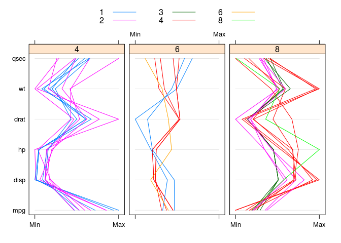<!-- -->

```r
data(gvhd10, package = "latticeExtra")
```

## Figure 5.19


```r
parallel(~ asinh(gvhd10[c(3, 2, 4, 1, 5)]), data = gvhd10, 
         subset = Days == "13", alpha = 0.01, lty = 1)
```

```
## Warning: 'parallel' is deprecated.
## Use 'parallelplot' instead.
## See help("Deprecated")
```

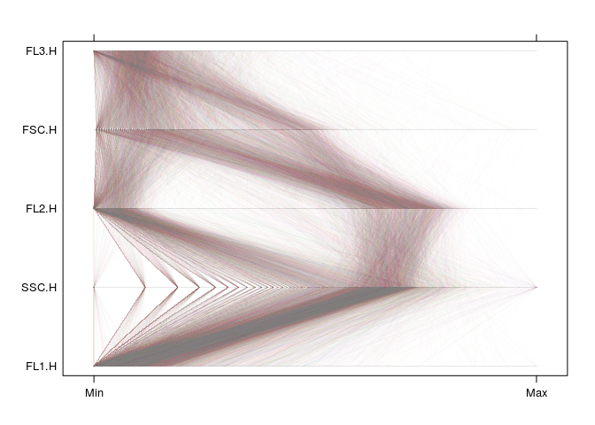<!-- -->


---
title: "ch5.R"
author: "takanori"
date: "Thu Nov  3 20:31:47 2016"
---
